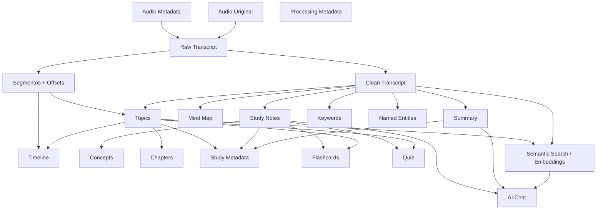

# Knowledge Pack — Especificación Funcional

tags: #product #knowledge-pack #spec

---

## Estructura de un componente

Todo componente del Knowledge Pack, sin importar si es MVP o roadmap, se especifica con los mismos ocho atributos:

| Atributo | Pregunta que responde |
|---|---|
| **Qué representa** | Descripción funcional |
| **Formato** | Tipo de dato / estructura |
| **Se genera en** | Etapa del pipeline responsable (ver [`03-intelligent-pipeline-design.md`](./03-intelligent-pipeline-design.md)) |
| **Depende de** | Componentes que deben existir antes |
| **Habilita** | Qué componentes o capacidades de UX se vuelven posibles gracias a este |
| **Costo relativo** | Ninguno / Bajo / Medio / Alto (ver metodología en [`03-intelligent-pipeline-design.md`](./03-intelligent-pipeline-design.md)) |
| **Fase** | MVP implementado / MVP próximo / Roadmap / Visión |
| **Regenerable independientemente** | Si se puede volver a generar sin rehacer todo el pack |

---

## Mapa de componentes

Este grafo es el criterio técnico de secuenciamiento: ningún componente puede generarse antes de que sus dependencias existan. Es la base del diseño del pipeline en el documento siguiente.

---

## Componentes MVP (implementados)

### Audio Original

- **Qué representa:** el archivo de audio subido por el usuario, en su formato nativo.
- **Formato:** binario en Azure Blob Storage (`webm`, `mp4`, `m4a`, `mp3`, `wav`, `ogg`, `flac`, `aac`).
- **Se genera en:** flujo de upload (`POST /init` + `PUT` directo a Blob) — no es parte del pipeline de IA.
- **Depende de:** nada (es el input raíz del Knowledge Pack).
- **Habilita:** todo el resto del pack; además, reproducción sincronizada (ver [`05-ux-capabilities.md`](./05-ux-capabilities.md)).
- **Costo relativo:** ninguno (almacenamiento, no cómputo de IA).
- **Fase:** MVP implementado.
- **Regenerable independientemente:** no aplica — es el dato fuente, inmutable.

### Audio Metadata

- **Qué representa:** características técnicas del audio — formato, sample rate, duración, locale, tamaño, checksum.
- **Formato:** fila relacional (`stt_recording`).
- **Se genera en:** validación en `POST /SpeechToTextv2` (Champion API).
- **Depende de:** Audio Original.
- **Habilita:** validaciones del pipeline, elección de idioma para transcripción.
- **Costo relativo:** ninguno.
- **Fase:** MVP implementado.
- **Regenerable independientemente:** no — es metadata descriptiva del recurso, no un artefacto de IA.

### Raw Transcript

- **Qué representa:** la transcripción literal del audio, fiel al habla (incluye muletillas, repeticiones, ruido conversacional).
- **Formato:** `TEXT` (`transcription_text`).
- **Se genera en:** etapa `transcription` — Azure AI Speech Fast Transcription.
- **Depende de:** Audio Original + Audio Metadata (formato, locale).
- **Habilita:** Clean Transcript y, transitoriamente hoy, Summary/Notes/Mind Map (ver nota de transición en [`03-intelligent-pipeline-design.md`](./03-intelligent-pipeline-design.md)).
- **Costo relativo:** medio (llamada HTTP a Fast Transcription, proporcional a duración del audio).
- **Fase:** MVP implementado.
- **Regenerable independientemente:** sí, en teoría (rehacer transcripción), pero no está expuesto como capacidad de usuario — hoy solo ocurre vía retry de job fallido.

### Segmentos + Offsets *(gap a cerrar — ver riesgos)*

- **Qué representa:** los fragmentos (`phrases[]`) que devuelve Fast Transcription, cada uno con su texto y su offset temporal dentro del audio.
- **Formato:** array de `{ text, offset_ms, duration_ms }`.
- **Se genera en:** la misma llamada de Fast Transcription que produce el Raw Transcript — **ya viene en la respuesta hoy, pero el código actual la descarta** (`speech_service.py` solo extrae `combinedPhrases[0].text`).
- **Depende de:** Raw Transcript (mismo origen).
- **Habilita:** Timeline, Topics con marcas de tiempo, citas temporales, reproducción sincronizada.
- **Costo relativo:** ninguno adicional — es dato ya disponible en la respuesta existente, solo falta persistirlo.
- **Fase:** MVP próximo — se recomienda implementarlo junto con Transcript Cleanup, no como etapa de IA sino como ajuste de persistencia. Ver recomendaciones en [`06-roadmap-risks-recommendations.md`](./06-roadmap-risks-recommendations.md).
- **Regenerable independientemente:** no aplica (subproducto directo de la transcripción).

### Clean Transcript

- **Qué representa:** el Raw Transcript limpio de artefactos de voz (muletillas, repeticiones, frases incompletas), preservando el significado.
- **Formato:** `TEXT` (`transcript_clean_text`, ya nombrado así en el roadmap técnico existente).
- **Se genera en:** etapa `transcript_cleanup` — gpt-5-mini.
- **Depende de:** Raw Transcript.
- **Habilita:** Summary, Notes, Mind Map, Keywords, Named Entities, Topics, Semantic Search (todos los componentes de contenido derivado deberían leer desde aquí, no desde Raw Transcript, una vez exista).
- **Costo relativo:** medio (una llamada a gpt-5-mini con el transcript completo como input).
- **Fase:** MVP próximo (ya identificado como próxima implementación en el proyecto).
- **Regenerable independientemente:** sí — si se regenera, todos sus dependientes deberían poder marcarse como potencialmente desactualizados (ver principio de invalidación en riesgos).

### Summary

- **Qué representa:** resumen ejecutivo estructurado (topics principales, insights, decisiones, conclusión).
- **Formato:** `TEXT` en Markdown (`summary_text`).
- **Se genera en:** etapa `summary` — gpt-5-mini.
- **Depende de:** Clean Transcript (objetivo) / Raw Transcript (hoy, transitoriamente).
- **Habilita:** Study Metadata, AI Chat (contexto de alto nivel).
- **Costo relativo:** medio.
- **Fase:** MVP implementado.
- **Regenerable independientemente:** sí.

### Study Notes

- **Qué representa:** notas estructuradas — conceptos con definición/explicación/contexto, ejemplos, detalles importantes, conclusiones clave.
- **Formato:** `TEXT` Markdown (`notes_text`) + `JSONB` estructurado (`notes_json`).
- **Se genera en:** etapa `notes` — gpt-5-mini.
- **Depende de:** Clean Transcript (objetivo) / Raw Transcript (hoy).
- **Habilita:** Concepts, Flashcards, Quiz, Study Metadata, AI Chat.
- **Costo relativo:** medio-alto (dos llamadas hoy: texto + JSON — ver oportunidad de fusión en riesgos).
- **Fase:** MVP implementado.
- **Regenerable independientemente:** sí.

### Mind Map

- **Qué representa:** árbol jerárquico de conceptos (hasta 4 niveles de profundidad).
- **Formato:** `JSONB` (`mind_map_json` — `{ title, nodes: [{ name, children[] }] }`).
- **Se genera en:** etapa `mind_map` — gpt-5-mini.
- **Depende de:** Clean Transcript (objetivo) / Raw Transcript (hoy).
- **Habilita:** visualización de mapa mental en la app (ya contemplado en mockups existentes).
- **Costo relativo:** medio.
- **Fase:** MVP implementado.
- **Regenerable independientemente:** sí.

### Processing Metadata

- **Qué representa:** el historial completo de procesamiento del pack — cada transición de estado, actor, timestamps, errores.
- **Formato:** filas relacionales (`ai_job`, `ai_job_status_history`).
- **Se genera en:** transversal — cada etapa del pipeline escribe aquí vía `sp_update_ai_job_status_v1`.
- **Depende de:** nada (existe desde que el job se crea).
- **Habilita:** polling, retry, observabilidad, y (roadmap) dashboard de costos/tiempos.
- **Costo relativo:** ninguno.
- **Fase:** MVP implementado.
- **Regenerable independientemente:** no aplica.

---

## Componentes Roadmap

### Topics

- **Qué representa:** los temas principales tratados en el audio, cada uno con nombre, rango temporal, resumen y puntos clave.
- **Formato:** `JSONB` — `{ topics: [{ id, name, start_ms, end_ms, summary, key_points[] }] }`.
- **Se genera en:** etapa `topic_extraction` (nueva) — gpt-5-mini, cruzando Clean Transcript con Segmentos + Offsets.
- **Depende de:** Clean Transcript, Segmentos + Offsets.
- **Habilita:** Timeline, Chapters, Study Mode, Flashcards, Quiz, Study Metadata, citas temporales, búsqueda con timestamp.
- **Costo relativo:** medio-alto (requiere razonamiento sobre transcripción + offsets).
- **Fase:** Roadmap — prioridad alta (es el componente que más otras capacidades desbloquea).
- **Regenerable independientemente:** sí, con impacto en cascada sobre Chapters/Flashcards/Quiz si ya existían.

### Timeline

- **Qué representa:** una vista navegable del audio como sucesión de momentos (no es un componente generado por IA — es una **proyección** de Topics + Segmentos).
- **Formato:** derivable en tiempo de lectura (vista/endpoint), potencialmente materializado por performance.
- **Se genera en:** capa de agregación, no en el pipeline de IA — se calcula a partir de Topics + Segmentos ya existentes.
- **Depende de:** Topics, Segmentos + Offsets.
- **Habilita:** scrubber de timeline en UI, navegación por momento.
- **Costo relativo:** ninguno (no consume IA).
- **Fase:** Roadmap.
- **Regenerable independientemente:** sí, sin costo — es recalculable en cualquier momento.

### Keywords

- **Qué representa:** términos clave del contenido (para filtrado, etiquetado, búsqueda rápida).
- **Formato:** `JSONB` — array de strings o `{ term, relevance }`.
- **Se genera en:** etapa `keyword_extraction` (nueva, paralela a Topics) — gpt-5-mini o modelo más liviano.
- **Depende de:** Clean Transcript.
- **Habilita:** etiquetado de packs, búsqueda por palabra clave, Study Metadata.
- **Costo relativo:** bajo (prompt simple, output corto).
- **Fase:** Roadmap — candidata a fusionarse con Named Entities o Topics en una sola llamada (ver [`06-roadmap-risks-recommendations.md`](./06-roadmap-risks-recommendations.md)).
- **Regenerable independientemente:** sí.

### Named Entities

- **Qué representa:** personas, organizaciones, lugares, fechas mencionadas explícitamente.
- **Formato:** `JSONB` — `{ entities: [{ text, type, mentions: [offset_ms] }] }`.
- **Se genera en:** etapa `entity_extraction` (nueva, paralela a Topics/Keywords).
- **Depende de:** Clean Transcript, Segmentos + Offsets (para ubicar menciones).
- **Habilita:** búsqueda por entidad, filtros ("audios donde se menciona X"), enriquecimiento de Study Metadata.
- **Costo relativo:** bajo-medio.
- **Fase:** Roadmap.
- **Regenerable independientemente:** sí.

### Concepts

- **Qué representa:** una vista elevada y potencialmente vinculada entre packs de los `concepts[]` que hoy ya existen dentro de `notes_json`. La diferencia con Notes es que Concepts aspira a ser una entidad de primera clase, reutilizable entre distintos Knowledge Packs de un mismo usuario (ej. "este concepto ya apareció en 3 grabaciones anteriores").
- **Formato:** `JSONB` por pack en el MVP de esta capacidad; tabla relacional propia si se implementa la vinculación entre packs.
- **Se genera en:** inicialmente no requiere una etapa nueva — es una reinterpretación de `notes_json.concepts`. La vinculación cross-pack es una capacidad de Visión, no de Roadmap cercano.
- **Depende de:** Study Notes.
- **Habilita:** grafo de conocimiento del usuario (Visión), relacionar grabaciones entre sí.
- **Costo relativo:** ninguno en su forma inicial (reutiliza Notes); alto si se implementa vinculación semántica cross-pack (requiere embeddings + comparación).
- **Fase:** Roadmap (vista simple) → Visión (grafo cross-pack).
- **Regenerable independientemente:** sí, en su forma inicial.

### Chapters

- **Qué representa:** una agrupación más gruesa de Topics, pensada para navegación tipo "índice de libro" en vez de segmentación fina.
- **Formato:** `JSONB` — `{ chapters: [{ name, topic_ids[], start_ms, end_ms }] }`.
- **Se genera en:** **no es una etapa de IA nueva** — es una agregación determinística sobre Topics (agrupar topics contiguos o generar un título de nivel superior con una llamada liviana opcional). Decisión de diseño: evitar una etapa de IA redundante — Chapters reutiliza Topics en vez de volver a analizar la transcripción completa.
- **Depende de:** Topics.
- **Habilita:** Study Mode, navegación por capítulos.
- **Costo relativo:** ninguno a bajo (agregación pura, o una llamada corta de agrupamiento/titulado).
- **Fase:** Roadmap.
- **Regenerable independientemente:** sí, sin costo relevante.

### Study Metadata

- **Qué representa:** metadatos de estudio — categoría/materia, nivel de dificultad estimado, tiempo estimado de estudio, tags.
- **Formato:** `JSONB` — `{ subject, difficulty, estimated_minutes, tags[] }`.
- **Se genera en:** etapa `study_classification` (nueva) — clasificación liviana sobre Summary + Notes + Topics.
- **Depende de:** Summary, Study Notes, Topics.
- **Habilita:** organización de la biblioteca del usuario, filtros, recomendaciones (Visión).
- **Costo relativo:** bajo.
- **Fase:** Roadmap.
- **Regenerable independientemente:** sí.

### Flashcards

- **Qué representa:** tarjetas de pregunta/respuesta generadas por topic, para repaso activo.
- **Formato:** `JSONB` — `{ flashcards: [{ topic_id, question, answer }] }`.
- **Se genera en:** etapa `flashcard_generation` (nueva) — gpt-5-mini, por topic.
- **Depende de:** Topics, Study Notes.
- **Habilita:** modo de repaso / spaced repetition (UX).
- **Costo relativo:** medio (una llamada por topic, o una llamada consolidada con todos los topics — decisión de implementación).
- **Fase:** Roadmap.
- **Regenerable independientemente:** sí, incluso por topic individual.

### Quiz

- **Qué representa:** preguntas de comprensión (opción múltiple o abiertas) generadas por topic.
- **Formato:** `JSONB` — `{ quiz: [{ topic_id, question, options[], correct_answer }] }`.
- **Se genera en:** etapa `quiz_generation` (nueva) — gpt-5-mini, por topic.
- **Depende de:** Topics, Study Notes.
- **Habilita:** modo quiz con scoring (UX).
- **Costo relativo:** medio.
- **Fase:** Roadmap.
- **Regenerable independientemente:** sí, por topic.

### Semantic Search (Embeddings)

- **Qué representa:** representación vectorial del contenido (chunks de transcripción y/o topics) que permite búsqueda por significado, no solo por palabra exacta.
- **Formato:** vectores (`VECTOR(n)`, requiere extensión `pgvector` — infraestructura nueva) asociados a fragmentos de texto.
- **Se genera en:** etapa `embedding_generation` (nueva) — modelo de embeddings (no gpt-5-mini; un modelo dedicado de embeddings de Azure OpenAI).
- **Depende de:** Clean Transcript, Topics (para definir límites de chunk con sentido semántico).
- **Habilita:** búsqueda semántica dentro de un audio y (Visión) entre todos los audios del usuario; es la base técnica de AI Chat.
- **Costo relativo:** medio (proporcional a la cantidad de chunks, pero embeddings son baratos por token comparado con generación).
- **Fase:** Roadmap avanzado / Visión — requiere decisión de infraestructura (adopción de `pgvector`) antes de comprometerse a fecha.
- **Regenerable independientemente:** sí, pero cualquier cambio en Clean Transcript o Topics debería invalidar embeddings existentes.

### AI Chat

- **Qué representa:** una interfaz conversacional donde el usuario pregunta sobre el contenido del audio y el sistema responde usando el Knowledge Pack como contexto (RAG).
- **Formato:** nueva entidad — sesión de chat + mensajes (`role`, `content`, `retrieved_context`).
- **Se genera en:** no es una etapa del pipeline batch — es un flujo síncrono/interactivo aparte que **consume** el Knowledge Pack ya generado (Summary, Notes, Semantic Search) como contexto de cada respuesta.
- **Depende de:** Semantic Search, Summary, Study Notes.
- **Habilita:** la capacidad de "conversar" con una grabación pasada.
- **Costo relativo:** alto y variable (por conversación, no por pack — cada mensaje es una llamada a gpt-5-mini con contexto recuperado).
- **Fase:** Visión.
- **Regenerable independientemente:** no aplica — es una capacidad interactiva, no un artefacto generado una vez.

---

## Resumen MVP vs Roadmap vs Visión

| Componente | Fase |
|---|---|
| Audio Original | MVP implementado |
| Audio Metadata | MVP implementado |
| Raw Transcript | MVP implementado |
| Summary | MVP implementado |
| Study Notes | MVP implementado |
| Mind Map | MVP implementado |
| Processing Metadata | MVP implementado |
| Clean Transcript | MVP próximo |
| Segmentos + Offsets | MVP próximo (gap de persistencia, no de IA) |
| Topics | Roadmap — prioridad alta |
| Chapters | Roadmap |
| Timeline | Roadmap (sin costo de IA) |
| Keywords | Roadmap |
| Named Entities | Roadmap |
| Study Metadata | Roadmap |
| Flashcards | Roadmap |
| Quiz | Roadmap |
| Concepts (vista simple) | Roadmap |
| Semantic Search | Roadmap avanzado |
| Concepts (grafo cross-pack) | Visión |
| AI Chat | Visión |

---

## Criterio para agregar un nuevo componente

Antes de implementar cualquier componente nuevo del Knowledge Pack, responder:

1. **¿Qué representa y en qué formato?** — texto, JSON estructurado, vector, relación.
2. **¿De qué depende?** — ubicar en el grafo de dependencias de este documento.
3. **¿Requiere una etapa de IA nueva o es una proyección/agregación de datos ya existentes?** (ej. Chapters no necesita IA nueva; Topics sí).
4. **¿Es MVP, roadmap o visión?** según cuántas otras capacidades depende de él y su costo.
5. **¿Es regenerable independientemente?** y si sí, ¿qué otros componentes deberían invalidarse cuando se regenera?
6. **¿Vive en una columna dedicada o en el modelo extensible de componentes?** — ver [`04-data-architecture.md`](./04-data-architecture.md). Regla general: MVP estable → columna dedicada; todo lo demás → componente extensible.

---

## Referencias

- [`01-knowledge-pack-vision.md`](./01-knowledge-pack-vision.md)
- [`03-intelligent-pipeline-design.md`](./03-intelligent-pipeline-design.md)
- [`04-data-architecture.md`](./04-data-architecture.md)
- [`05-ux-capabilities.md`](./05-ux-capabilities.md)
