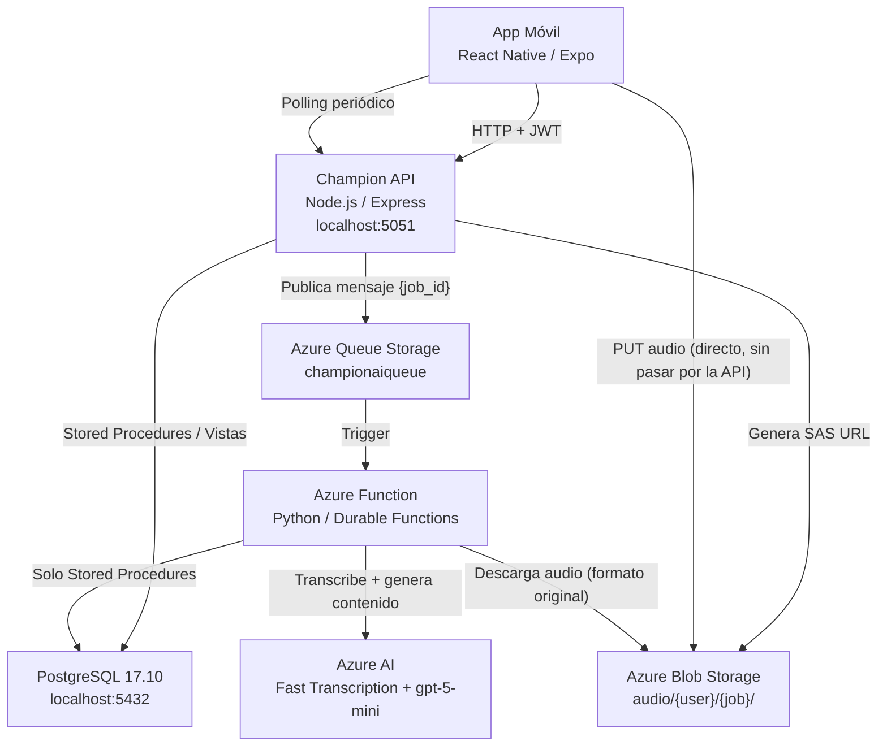

# 00 — Project Overview: Champion AI

tags: #overview #master #rag-index

> Archivo maestro de visión global. Punto de entrada recomendado para cualquier sistema RAG que
> indexe esta bóveda de conocimiento. Para detalle técnico profundo de librerías, endpoints y base
> de datos, ver [[TECHNICAL_STACK_AND_SERVICES]].
>
> Última actualización: 2026-08-12 — auditoría completa de la bóveda (skill `sync-knowledge-vault`):
> cierre de M1/Knowledge Workspace reflejado, endpoint surface completo re-verificado contra el
> código real, espejos de `CLAUDE.md`/`ARCHITECTURE.md` agregados en `Reference/`.

---

## 1. Resumen ejecutivo

**Champion AI** es una **plataforma de aprendizaje asistida por Inteligencia Artificial**,
organizada alrededor del concepto de **Knowledge Workspace**.

Cadena de valor del producto:

```
Champion AI → Knowledge Packs → Knowledge Workspace → Herramientas Inteligentes de Aprendizaje
```

- **Champion AI**: el hub que orquesta la ingesta de contenido y los servicios de IA de Azure.
- **Knowledge Pack**: la unidad de conocimiento generada por el pipeline de IA a partir de una
  fuente (hoy, audio grabado) — transcripción, resumen, notas estructuradas y mapa mental.
- **Knowledge Workspace**: la superficie de consumo principal de la app (reemplaza a la antigua
  vista Markdown), donde el usuario navega audio + resumen + notas + mapa mental de forma
  integrada.
- **Herramientas Inteligentes de Aprendizaje**: capacidades futuras construidas sobre el Workspace
  (flashcards, quiz, chat, narración, búsqueda semántica).

La primera feature implementada de extremo a extremo es **Speech-to-Text (STT) live_recording**:
el usuario graba o sube audio → la app lo sube directo a Azure Blob Storage → la API lo encola →
una Azure Function transcribe, resume, genera notas y un mapa mental → el resultado (un
**Knowledge Pack**) se consume desde el Knowledge Workspace.

**Usuario objetivo:** personas que aprenden a partir de contenido grabado — estudiantes que graban
clases, profesionales que graban charlas o reuniones formativas.

**Estado del proyecto:** desarrollo activo. La base técnica (pipeline STT completo, autenticación,
polling, gestión de Knowledge Packs) y el Knowledge Workspace (V1 del roadmap) están implementados
y en producción desde 2026-08-10. El desarrollo activo ahora se enfoca en EPIC V2 — Intelligent
Study (Transcript Cleanup, Topics). Ver [[MILESTONES]].

**Equipo:** Nicolás Bustamante y Sebastián Caneo (desarrolladores). Metodología Scrum.

---

## 2. Stack Tecnológico Real

Desglose por capa arquitectónica.

| Capa | Tecnología | Rol en el sistema |
|---|---|---|
| App móvil | React Native 0.81.5 + Expo ~54.0.0 | Interfaz de usuario, captura de audio, consumo de la API |
| Backend / API | Node.js + Express.js 5.x — puerto `5051` | Orquestación: auth, validación, SAS URLs, creación de jobs, polling |
| Procesamiento serverless | Azure Function App (Python) — Azure Durable Functions | Pipeline de IA completo: transcripción, resumen, notas, mapa mental |
| Base de datos | PostgreSQL 17.10 (Docker) — puerto `5432` | Única fuente de verdad: usuarios, jobs, resultados |
| Almacenamiento de archivos | Azure Blob Storage | Almacena el audio subido, fuera del alcance de la API |
| Cola de mensajes | Azure Queue Storage (`championaiqueue`) | Desacopla la API del procesamiento pesado |
| Transcripción de audio | Azure AI Speech — Fast Transcription REST API | Audio → texto, sin conversión previa de formato |
| Generación de contenido | Azure OpenAI — `gpt-5-mini` (modelo de razonamiento) | Resumen, notas y mapa mental a partir del texto transcrito |
| Autenticación | JWT (`jsonwebtoken`) + `bcrypt` | Identidad y protección de endpoints |

> No existe un componente de "AI local" (modelos on-device): toda la inteligencia artificial del
> sistema se ejecuta en servicios gestionados de Azure, invocados exclusivamente desde la Azure
> Function.

Ver [[TECHNICAL_STACK_AND_SERVICES]] para el detalle de librerías por componente.

---

## 3. Mapa de arquitectura general

### 3.1 Diagrama de interconexión



### 3.2 Componentes y su responsabilidad exclusiva

| Componente | Hace | No hace |
|---|---|---|
| App Móvil | Captura audio, sube a Blob, crea el job, hace polling, muestra resultados | Lógica de negocio, llamadas a Azure/PostgreSQL, procesamiento de IA |
| Champion API | Auth, validación, SAS URLs, crear jobs (via SP), publicar en queue, exponer polling | Procesar IA, recibir binarios de audio, DML directo en tablas de dominio |
| Azure Function | Consumir la queue, ejecutar el pipeline de IA completo, persistir resultados | Coordinar entre componentes, llamar a la API, DML directo (solo Stored Procedures) |
| PostgreSQL | Persistir todo el estado (usuarios, jobs, resultados, historial) | — es la única fuente de verdad, no hay caché de estado en memoria |
| Azure Queue Storage | Desacoplar API y Function con mensajes `{ job_id }`, garantía at-least-once | No transporta payloads grandes ni resultados |
| Azure Blob Storage | Almacenar el audio subido directamente por el cliente | No pasa nunca por la API |
| Azure AI (Speech + OpenAI) | Transcripción y generación de contenido, invocado solo desde la Function | No se invoca nunca desde la API ni desde la app móvil |

### 3.3 Flujo de datos de alto nivel

```
register → login → init upload (SAS URL) → PUT audio a Blob → create job (queued)
   → [Azure Queue] → Azure Function trigger
   → transcription → summary → notes → mind_map → completed
   → [polling del cliente] → GET status → GET result
```

Ver [[Architecture/overview]] para el diagrama detallado y [[Flows/stt-processing]] /
[[Flows/upload-audio]] / [[Flows/polling]] para los flujos paso a paso.

---

## 4. Principios arquitectónicos invariantes

Estos 10 principios gobiernan toda decisión de diseño en el proyecto (fuente: `CLAUDE.md` raíz):

1. **La API orquesta — no procesa.** Nunca ejecuta IA, nunca procesa binarios de audio.
2. **Las Functions procesan — no coordinan.** No llaman a la API, no hacen DML directo.
3. **PostgreSQL es la fuente de verdad.** No hay estado en memoria entre componentes.
4. **Las colas desacoplan componentes.** Mensaje mínimo `{ job_id }`, at-least-once delivery.
5. **Los Stored Procedures son el contrato del dominio.** Cero DML directo en tablas de dominio.
6. **Todo procesamiento es idempotente.** Doble guardia: `fn_can_process_ai_job` + `ON CONFLICT DO UPDATE`.
7. **El cliente hace polling.** Sin WebSocket ni push real del servidor (las notificaciones locales
   del SO en mobile son 100% cliente, basadas en el mismo polling).
8. **Contrato de respuesta HTTP invariante.** `{ success, data, error }` en toda respuesta.
9. **El audio nunca pasa por la API.** Subida directa a Blob vía SAS URL.
10. **El `user_id` siempre viene del JWT.** Nunca se acepta del payload del cliente.

---

## 5. Estado actual de las features

| Feature | Estado |
|---|---|
| Auth — register + login | Implementado |
| STT — init upload (SAS URL) | Implementado |
| STT — create job + enqueue | Implementado |
| STT — Azure Function pipeline (Durable Functions) | Implementado |
| STT — `GET /jobs/{id}/status` | Implementado |
| STT — `GET /jobs/{id}/result` | Implementado |
| STT — retry de jobs fallidos | Implementado |
| Gestión de Knowledge Packs — renombrar, eliminar (soft delete), reprocesar un step | Implementado |
| Notificaciones locales de job terminado (cliente) | Implementado |
| Subida de audio en segundo plano (background upload manager) | Implementado |
| Perfil de usuario (`/API/USER/me`, avatar) | Implementado |
| Refresh de JWT (`POST /API/AUTH/refresh`) | Implementado |
| Descarga y streaming de audio original (`/jobs/{id}/download`, `/stream`) | Implementado |
| Knowledge Workspace (V1) | **Implementado — en producción desde 2026-08-10** (ver [[ADR-014-knowledge-workspace-versioning]]) |
| Intelligent Study — Transcript Cleanup, Topics, Timeline (V2) | Roadmap — próximo a iniciar |
| Knowledge Enrichment — keywords, entidades, favoritos (V2.5) | Roadmap |
| AI Learning Platform — Flashcards, Quiz, Chat (V3) | Roadmap |
| Intelligent Audio Learning — narración TTS (V4) | Roadmap |
| Knowledge Platform — grafo, búsqueda semántica (V5) | Roadmap |

> **Retirado del roadmap activo:** Gestión de Archivos genérica (reemplazada conceptualmente por
> Knowledge Packs). TTS como feature standalone (absorbido dentro de V4, acotado a narración).

---

## 6. Referencias cruzadas de la Bóveda de Conocimiento

| Área | Documentos clave |
|---|---|
| Ficha técnica detallada | [[TECHNICAL_STACK_AND_SERVICES]] |
| Arquitectura | `App/Knowledge/Architecture/overview.md`, `backend-api.md`, `azure-function.md`, `azure-services.md` |
| Base de datos | `App/Knowledge/Database/schema-overview.md`, `tables.md`, `views.md`, `stored-procedures.md`, `functions.md`, `job-states.md` |
| Flujos end-to-end | `App/Knowledge/Flows/registration.md`, `login.md`, `upload-audio.md`, `stt-processing.md`, `polling.md` |
| Features | `App/Knowledge/Features/speech-to-text.md`, `summaries.md`, `notes.md`, `mind-maps.md`, `text-to-speech.md` |
| Producto y roadmap | `App/Knowledge/Product/PROJECT_VISION.md`, `PRODUCT_STRATEGY.md`, `App/Knowledge/Roadmap/ROADMAP.md`, `EPICS.md`, `BACKLOG.md`, `MILESTONES.md`, `SPRINT_PLANNING.md` |
| Decisiones de arquitectura (ADR) | `App/Knowledge/ADR/ADR-001` a `ADR-014` (ver índice completo en `README.md`) |
| Operación | `App/Knowledge/Operations/local-setup.md`, `error-codes.md`, `database-management.md` |
| Vacíos y bugs conocidos | `App/Knowledge/Bugs/known-issues.md` |
| Historial de sesiones de trabajo | `App/Knowledge/Changelog/` |
| Prompts de Azure OpenAI (espejo, sincronizado) | `App/Knowledge/Prompts/` |
| **Espejos verbatim de `CLAUDE.md`/`ARCHITECTURE.md`** (para consumidores que solo indexan `App/Knowledge/`) | `App/Knowledge/Reference/CLAUDE.md`, `ARCHITECTURE.md`, `API-CLAUDE.md`, `Mobile-CLAUDE.md`, `procesamiento-CLAUDE.md` |
| Contexto por componente (fuente original, fuera de la bóveda) | `App/API/CLAUDE.md`, `App/Mobile/CLAUDE.md`, `App/procesamiento/CLAUDE.md` |
