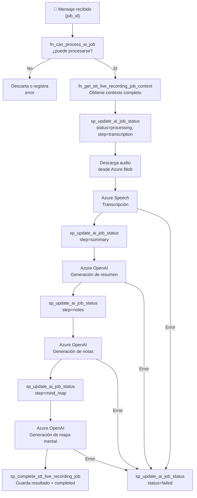

# Azure Function — Queue Trigger

tags: #architecture #azure #function #serverless

---

## Descripción

La Azure Function es el componente de procesamiento del sistema. Se dispara automáticamente cuando la API publica un mensaje en la queue `champion-ai-stt-live-recording`.

> **Tecnología:** El README menciona "Java" en un apartado y "Python" en otro. Esta contradicción está sin resolver. Ver [[known-issues]].

---

## Trigger

```
Queue: champion-ai-stt-live-recording
Mensaje: { "job_id": "job_550e8400-..." }
```

La Function recibe únicamente el `job_id`. El contexto completo lo obtiene consultando PostgreSQL.

---

## Flujo de ejecución



---

## Pasos de procesamiento

| Paso | Step name | Acción |
|---|---|---|
| 1 | `transcription` | Descarga audio de Blob → Azure Speech → texto |
| 2 | `summary` | Texto → Azure OpenAI → resumen estructurado |
| 3 | `notes` | Texto → Azure OpenAI → notas (texto + JSON) |
| 4 | `mind_map` | Texto → Azure OpenAI → mapa mental (JSON) |
| — | `completed` | Guarda todo en `stt_recording_result` |

---

## Regla de acceso a base de datos

> **La Azure Function NUNCA ejecuta DML directo (INSERT, UPDATE, DELETE).**
> Solo puede llamar Stored Procedures.

Esta regla es un principio arquitectónico. Ver [[ADR-002-stored-procedures-only]].

### SPs que puede llamar

| Stored Procedure | Cuándo |
|---|---|
| `fn_can_process_ai_job` | Antes de comenzar — guarda de idempotencia |
| `fn_get_stt_live_recording_job_context` | Para obtener todo el contexto del job |
| `sp_update_ai_job_status_v1` | En cada transición de estado/paso |
| `sp_complete_stt_live_recording_job_v1` | Al finalizar con éxito |

---

## Conexión a base de datos

La Azure Function se conecta **directamente a PostgreSQL**. No llama al backend.

```
Azure Function → PostgreSQL (directo)
Azure Function ≠ Champion API
```

Razón: el backend no debería ser intermediario para operaciones de escritura masiva y continua durante el procesamiento.

---

## Manejo de errores

Si cualquier paso falla, la Function ejecuta:

```sql
sp_update_ai_job_status_v1(
  p_job_id     => '{job_id}',
  p_status     => 'failed',
  p_step_name  => '{paso_que_falló}',
  p_error_code => 'STT_ENGINE_UNAVAILABLE' -- u otro código relevante
)
```

El job queda en estado `failed` con el error registrado en `ai_job` y en `ai_job_status_history`.

---

## Idempotencia

Azure Queue garantiza **at-least-once delivery**: el mismo mensaje puede llegar más de una vez.

La Function maneja esto así:

1. Consulta `fn_can_process_ai_job` al inicio
2. Si el job ya está `completed` o `failed` → detiene el procesamiento
3. Si llega a guardar el resultado, `sp_complete_stt_live_recording_job_v1` usa `ON CONFLICT DO UPDATE`

Ver [[ADR-006-idempotent-stored-procedures]].

---

## Output del procesamiento

Todo el resultado se almacena en `stt_recording_result`:

| Campo | Tipo | Contenido |
|---|---|---|
| `transcription_text` | TEXT | Transcripción completa del audio |
| `summary_text` | TEXT | Resumen en formato texto |
| `notes_text` | TEXT | Notas en formato texto |
| `notes_json` | JSONB | Notas estructuradas |
| `mind_map_json` | JSONB | Mapa mental estructurado |
| `raw_result_json` | JSONB | Respuesta cruda de los servicios AI |

Ver [[summaries]], [[notes]], [[mind-maps]], [[tables]].

---

## Referencias cruzadas

- [[overview]] — Arquitectura general
- [[azure-services]] — Azure Blob, Queue y AI
- [[stt-processing]] — Flujo de procesamiento completo
- [[stored-procedures]] — SPs que usa la Function
- [[job-states]] — Máquina de estados del job
- [[ADR-002-stored-procedures-only]] — Por qué solo SPs
- [[ADR-006-idempotent-stored-procedures]] — Idempotencia
