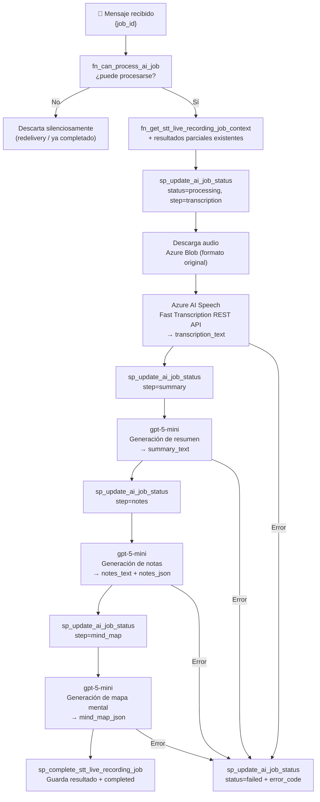

# Azure Function — Queue Trigger (Python / Durable Functions)

tags: #architecture #azure #function #serverless #python

---

## Descripción

La Azure Function es el componente de procesamiento del sistema. Se dispara automáticamente cuando la API publica un mensaje en la queue `championaiqueue`.

**Lenguaje:** Python. **Patrón de ejecución:** Azure Durable Functions — Orchestrator + Activities.

---

## Trigger

```
Queue: championaiqueue
Mensaje: { "job_id": "job_550e8400-..." }
```

La Function recibe únicamente el `job_id`. El contexto completo lo obtiene consultando PostgreSQL.

---

## Estructura de archivos

```
procesamiento/
  function_app.py              ← entry point — registra todos los blueprints
  config.py                    ← variables de entorno
  requirements.txt             ← azure-functions, openai, requests, psycopg2-binary...
  local.settings.json          ← config local (no commitear)

  orchestrators/
    stt_live_recording.py      ← orquestador Durable (solo flujo, sin I/O)

  activities/
    context_activity.py        ← check_and_get_context + set_job_status
    transcription_activity.py  ← transcribe_audio
    ai_activity.py             ← generate_summary, generate_notes, generate_mind_map
    completion_activity.py     ← complete_job_activity + save_partial_result_activity

  trigger/
    queue_trigger.py           ← Queue trigger → arranca stt_live_recording

  shared/
    database/
      db_client.py             ← pool de conexiones PostgreSQL
      job_repository.py        ← wrappers para SPs y SQL functions
    services/
      blob_service.py          ← descarga de audio desde Azure Blob
      speech_service.py        ← transcripción via Fast Transcription REST API
      openai_service.py        ← resumen, notas, mapa mental via gpt-5-mini
    utils/
      constants.py             ← JobStatus, ProcessingStep, ErrorCode, ACTOR_TYPE

  prompts/
    system.md                  ← system prompt de Champion AI (para gpt-5-mini)
    summary.md
    notes.md
    notes_json.md
    mind_map.md
```

---

## Flujo de ejecución



---

## Pasos de procesamiento

| Paso | Step name | Servicio | Acción |
|---|---|---|---|
| 1 | `transcription` | Azure AI Speech Fast Transcription | Descarga audio de Blob (formato original) → REST API → texto |
| 2 | `summary` | gpt-5-mini | Texto → resumen ejecutivo en Markdown |
| 3 | `notes` | gpt-5-mini | Texto → notas estructuradas (Markdown + JSON) |
| 4 | `mind_map` | gpt-5-mini | Texto → árbol jerárquico JSON |
| — | `completed` | — | Guarda todo en `stt_recording_result` |

**Próxima etapa planificada:** `transcript_cleanup` entre `transcription` y `summary`. Ver [[pipeline-roadmap]].

---

## Smart retry — Persistencia de resultados parciales

Después de cada paso de IA exitoso, la Function persiste el resultado via `sp_save_stt_partial_result_v1` (COALESCE upsert). Al inicio de cada ejecución, `check_and_get_context` lee estos resultados parciales y el orquestador omite los pasos ya completados.

Esto garantiza que un retry solo reprocesa desde el paso que falló, evitando costos duplicados de Azure Speech y Azure OpenAI.

---

## Regla de acceso a base de datos

> **La Azure Function NUNCA ejecuta DML directo (INSERT, UPDATE, DELETE).**
> Solo puede llamar Stored Procedures.

Esta regla es un principio arquitectónico. Ver [[ADR-002-stored-procedures-only]].

### SPs que puede llamar

| SP / Function | Cuándo |
|---|---|
| `fn_can_process_ai_job` | Primer paso — guard de idempotencia |
| `fn_get_stt_live_recording_job_context` | Obtiene contexto completo + step actual |
| `sp_update_ai_job_status_v1` | En cada transición de estado/paso |
| `sp_save_stt_partial_result_v1` | Tras cada paso de IA exitoso (smart retry) |
| `sp_complete_stt_live_recording_job_v1` | Al finalizar con éxito |

---

## Conexión a base de datos

La Azure Function se conecta **directamente a PostgreSQL**. No llama al backend.

```
Azure Function → PostgreSQL :5432 (directo)
Azure Function ≠ Champion API
```

---

## Manejo de errores

Si cualquier paso falla, la Function ejecuta:

```python
sp_update_ai_job_status_v1(
  p_job_id     = '{job_id}',
  p_status     = 'failed',
  p_step_name  = '{paso_que_falló}',
  p_error_code = 'STT_ENGINE_UNAVAILABLE'  # u otro código relevante
)
```

| Step | Error code |
|---|---|
| `transcription` | `STT_ENGINE_UNAVAILABLE` |
| `summary`, `notes`, `mind_map` | `OPENAI_UNAVAILABLE` |
| `complete_job` | `INTERNAL_ERROR` |

---

## Idempotencia

Azure Queue garantiza **at-least-once delivery**: el mismo mensaje puede llegar más de una vez.

La Function lo maneja con defensa en profundidad:

1. `fn_can_process_ai_job` — si el job ya está `completed` o `failed`, detiene el procesamiento silenciosamente
2. `sp_save_stt_partial_result_v1` — COALESCE upsert: el segundo intento no sobreescribe resultados ya correctos
3. `sp_complete_stt_live_recording_job_v1` — `ON CONFLICT DO UPDATE` en `stt_recording_result`

Ver [[ADR-006-idempotent-stored-procedures]].

---

## Output del procesamiento

Todo el resultado se almacena en `stt_recording_result`:

| Campo | Tipo | Contenido |
|---|---|---|
| `transcription_text` | TEXT | Transcripción completa del audio |
| `summary_text` | TEXT | Resumen ejecutivo en Markdown |
| `notes_text` | TEXT | Notas estructuradas en Markdown |
| `notes_json` | JSONB | Notas en JSON `{title, overview, concepts[], examples[], important_details[], key_takeaways[]}` |
| `mind_map_json` | JSONB | Árbol JSON `{title, nodes[{name, children[]}]}` — profundidad máx. 4 |

---

## Notas de integración con gpt-5-mini

- No acepta `temperature` (solo soporta el valor por defecto = 1)
- Parámetro correcto: `max_completion_tokens` (no `max_tokens`)
- Los tokens de razonamiento interno cuentan contra el presupuesto
- Configurado con `max_completion_tokens: 16384` — necesario para modelos de razonamiento

---

## Referencias cruzadas

- [[overview]] — Arquitectura general
- [[azure-services]] — Azure Blob, Queue, Fast Transcription y OpenAI
- [[stt-processing]] — Flujo de procesamiento completo
- [[stored-procedures]] — SPs que usa la Function
- [[job-states]] — Máquina de estados del job
- [[pipeline-roadmap]] — Evolución futura del pipeline
- [[ADR-002-stored-procedures-only]] — Por qué solo SPs
- [[ADR-006-idempotent-stored-procedures]] — Idempotencia
- [[ADR-007-fast-transcription]] — Por qué Fast Transcription
