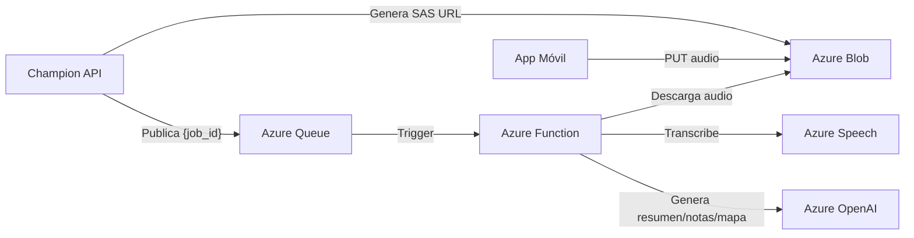

# Azure Services

tags: #architecture #azure #cloud

---

## Servicios de Azure utilizados

Champion AI utiliza tres categorías de servicios de Azure:

1. **Azure Blob Storage** — almacenamiento de archivos de audio
2. **Azure Queue Storage** — desacoplamiento entre API y procesamiento
3. **Azure AI** — inteligencia artificial (Speech + OpenAI)

---

## Azure Blob Storage

### Propósito

Almacena los archivos de audio subidos por los usuarios antes de ser procesados.
La API **nunca recibe el binario**: genera una SAS URL y el cliente sube directamente.

Ver [[ADR-003-sas-direct-upload]].

### Estructura de paths

```
audio/
  {user_uuid}/
    {job_id}/
      {job_id}.webm
```

El path incluye el `user_id` para aislar los archivos de cada usuario y el `job_id` para correlacionar con el job de procesamiento.

### SAS URL

- Generada por el backend en `POST /AIServices/Speechv2/init`
- Expira en `3600` segundos (1 hora)
- Permite únicamente la operación `PUT` sobre el blob específico
- Headers requeridos al subir:
  ```
  x-ms-blob-type: BlockBlob
  Content-Type: audio/{formato}
  ```

### Formatos de audio soportados

| Formato | MIME type |
|---|---|
| `webm` | `audio/webm` |
| `mp4` | `audio/mp4` |
| `m4a` | `audio/m4a` |
| `mp3` | `audio/mp3` |
| `wav` | `audio/wav` |
| `ogg` | `audio/ogg` |

Restricción aplicada en la tabla `stt_recording` via constraint `chk_stt_recording_audio_format`.

---

## Azure Queue Storage

### Propósito

Desacopla la recepción del job (API) del procesamiento pesado (Azure Function).
Permite que la API responda `202 Accepted` de inmediato sin esperar la ejecución de la IA.

### Queue del sistema STT

```
Nombre: champion-ai-stt-live-recording
```

El nombre de la queue define el **bounded context**: todo lo relacionado con STT live_recording pasa por esta queue.

### Mensaje publicado

```json
{ "job_id": "job_550e8400-e29b-41d4-a716-446655440000" }
```

Deliberadamente mínimo: la Function obtiene el contexto completo desde PostgreSQL mediante `fn_get_stt_live_recording_job_context`.

### Garantía de entrega

**At-least-once delivery**: el mismo mensaje puede llegar más de una vez a la Function.
Por eso todos los Stored Procedures del procesamiento son idempotentes.
Ver [[ADR-006-idempotent-stored-procedures]].

### Caso de error al publicar

Si el backend no puede publicar en la queue, ejecuta:
```
sp_update_ai_job_status_v1 → status=failed, error_code=QUEUE_SEND_FAILED
```
El job queda en `failed` antes de llegar a la queue.

---

## Azure AI

### Servicios utilizados

| Servicio | Uso en el sistema |
|---|---|
| Azure Speech | Transcripción de audio a texto (paso `transcription`) |
| Azure OpenAI | Generación de resumen, notas y mapa mental |

### Integración

Los servicios de AI son llamados exclusivamente desde la **Azure Function**, nunca desde la API.
El resultado se almacena en `stt_recording_result` y no se re-procesa.

### Detalles pendientes de documentación

Los siguientes aspectos no están documentados en las fuentes disponibles:

- Modelos de Azure OpenAI utilizados (GPT-4, GPT-3.5, etc.)
- Prompts para generación de resumen, notas y mapa mental
- Configuración de Azure Speech (modelos, idiomas soportados además de `es-CL`)
- Manejo de rate limits o errores de servicio
- Timeouts configurados en la Function

Ver [[known-issues]] para el registro completo de vacíos.

### Idioma

El idioma es un parámetro del job. El valor por defecto en la BD es `es-CL` (Spanish Chile), pero el contrato API acepta cualquier `locale` y `locale_name`.

---

## Dependencias entre servicios



---

## Referencias cruzadas

- [[overview]] — Arquitectura general y diagrama principal
- [[azure-function]] — Quién usa estos servicios y cómo
- [[ADR-003-sas-direct-upload]] — Por qué el upload es directo
- [[ADR-001-queue-based-processing]] — Por qué usar queue
- [[upload-audio]] — Flujo completo con SAS URL
- [[stt-processing]] — Flujo de procesamiento en la Function
