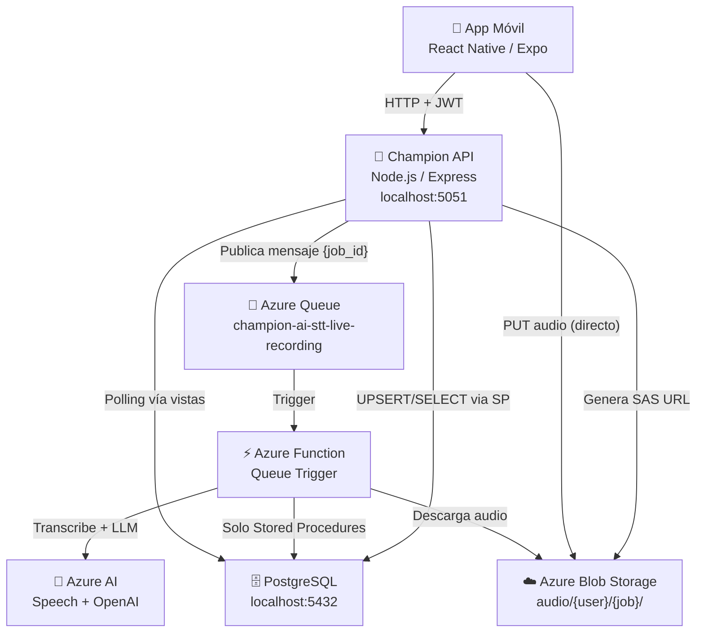

# Arquitectura del Sistema

tags: #architecture #overview

---

## Diagrama general



---

## Principio arquitectónico central

> El procesamiento de IA es **asíncrono y desacoplado**. La API no procesa: coordina. Azure Function no coordina: procesa.

Este principio se manifiesta en:

1. La API acepta el job y responde `202 Accepted` inmediatamente
2. El trabajo real ocurre en Azure Function, disparada por la cola
3. El cliente hace polling para conocer el resultado

---

## Componentes y responsabilidades

### App Móvil — React Native (Expo)

Responsable de:
- Grabar o seleccionar audio
- Solicitar y obtener la SAS URL para subida
- Subir el audio directamente a Azure Blob
- Crear el job de procesamiento en la API
- Hacer polling hasta obtener el resultado
- Mostrar transcripción, resumen, notas y mapa mental

**No procesa IA. No sabe de queues.**

Ver [[backend-api]] para los contratos HTTP que consume.

---

### Backend API — Node.js / Express

Puerto: `5051`

Responsable de:
- Autenticación y autorización (JWT)
- Validación de payloads entrantes
- Generación de SAS URLs (acceso temporal a Azure Blob)
- Creación de jobs via Stored Procedures
- Publicación de mensajes en Azure Queue
- Exposición de endpoints de polling (estado y resultado)
- Centralizar toda la lógica de negocio del sistema

**No ejecuta procesamiento de IA. No hace DML directo en BD.**

Ver [[backend-api]] para el detalle completo.

---

### Azure Function — Queue Trigger

Trigger: `champion-ai-stt-live-recording`

Responsable de:
- Consumir mensajes desde la queue
- Obtener contexto del job desde PostgreSQL (`fn_get_stt_live_recording_job_context`)
- Descargar el audio desde Azure Blob
- Ejecutar transcripción (Azure Speech)
- Ejecutar generación de resumen, notas y mapa mental (Azure OpenAI)
- Guardar resultados en PostgreSQL via Stored Procedures
- Actualizar estado del job en cada paso

**Regla absoluta: solo puede llamar Stored Procedures. Nunca DML directo.**

Ver [[azure-function]] y [[ADR-002-stored-procedures-only]].

---

### PostgreSQL 17.10

Contenedor Docker, puerto `5432`. Usuario: `champion_db_user`. BD: `champion_db`.

Responsable de:
- Persistir todos los datos del sistema
- Exponer lógica de dominio via Stored Procedures
- Proveer vistas para consultas eficientes de la API
- Garantizar integridad referencial
- Mantener historial completo de estados de cada job

Ver [[schema-overview]] para el modelo de datos.

---

### Azure Queue Storage

Queue: `champion-ai-stt-live-recording`

El nombre de la queue define el **bounded context** del servicio STT.

Mensaje publicado:
```json
{ "job_id": "job_550e8400-..." }
```

Garantía: **at-least-once delivery**. Por eso los Stored Procedures son idempotentes.
Ver [[ADR-006-idempotent-stored-procedures]].

---

### Azure Blob Storage

Estructura de paths:
```
audio/
  {user_uuid}/
    {job_id}/
      {job_id}.webm
```

Formatos soportados: `webm`, `mp4`, `m4a`, `mp3`, `wav`, `ogg`

El cliente sube **directamente** via SAS URL. La API nunca recibe el binario.
Ver [[ADR-003-sas-direct-upload]].

---

### Azure AI Services

Servicios utilizados en el flujo STT:
- **Azure Speech** — Transcripción de audio a texto
- **Azure OpenAI** — Generación de resumen, notas y mapa mental

Detalles de modelos, configuración y prompts: **no documentados en las fuentes disponibles**. Ver [[known-issues]].

---

## Restricciones arquitectónicas

| Restricción | Impacto |
|---|---|
| Azure Function solo usa SPs | Cambios de dominio solo en SQL, no en código de Function |
| API no recibe binarios de audio | Escalabilidad: el storage no pasa por la API |
| Queue garantiza at-least-once | Los SPs deben ser idempotentes |
| JWT requerido en todos los endpoints (excepto register/login) | No hay endpoints públicos de procesamiento |

---

## Flujo de datos de alto nivel

Ver [[upload-audio]] y [[stt-processing]] para los flujos detallados paso a paso.

```
register → login → init upload → PUT audio → create job
→ [queue] → function trigger → AI processing → save result
→ [polling] → get result
```
