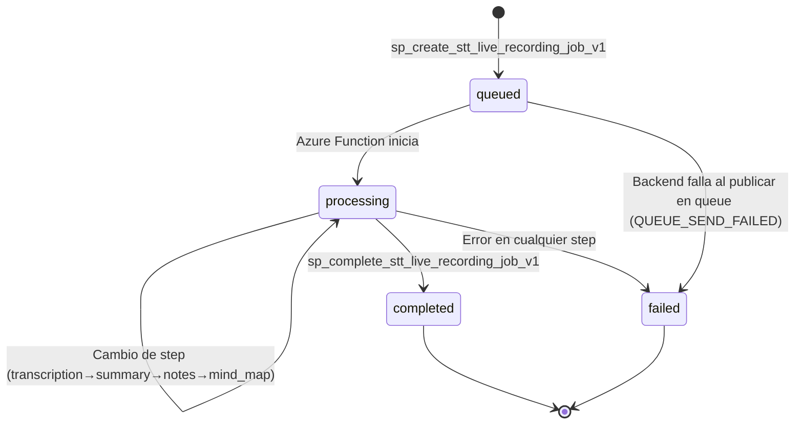

# Máquina de Estados de un Job

tags: #database #states #job #workflow

---

## Descripción

Todo job en Champion AI sigue una máquina de estados estricta. Los estados válidos están definidos por constraints en la base de datos (`chk_ai_job_status`).

---

## Estados válidos

| Estado | Descripción |
|---|---|
| `queued` | Job creado, esperando ser procesado por la Azure Function |
| `processing` | Azure Function está ejecutando el job actualmente |
| `completed` | Procesamiento finalizado con éxito |
| `failed` | Procesamiento terminó con error |

---

## Diagrama de transiciones



---

## Steps del estado processing

El estado `processing` no es monolítico: tiene sub-pasos (`current_step`).

| Step | Actor | Qué ocurre |
|---|---|---|
| `transcription` | Azure Function | Descarga audio → Azure Speech → texto |
| `summary` | Azure Function | Texto → Azure OpenAI → resumen |
| `notes` | Azure Function | Texto → Azure OpenAI → notas texto + JSON |
| `mind_map` | Azure Function | Texto → Azure OpenAI → mapa mental JSON |

---

## Secuencia completa de estados

```
queued
↓ (Azure Function consume mensaje)
processing / transcription
↓
processing / summary
↓
processing / notes
↓
processing / mind_map
↓
completed
```

---

## Transiciones de error

Desde cualquier step en `processing`:

```
processing / {step} → failed
```

Con `error_code` y `error_message` registrados en:
- `ai_job.last_error_code`
- `ai_job.last_error_message`
- `ai_job_status_history.error_code`

---

## Actores que producen transiciones

| Actor | Transición que puede producir |
|---|---|
| Backend API | `[inicio] → queued` |
| Backend API | `queued → failed` (si falla la publicación en queue) |
| Azure Function | `queued → processing/transcription` |
| Azure Function | `processing/X → processing/Y` |
| Azure Function | `processing/Y → completed` |
| Azure Function | `processing/X → failed` |

El campo `created_by_type` en `ai_job_status_history` registra qué actor produjo cada transición.

Valores posibles: `user | system | backend | azure_function | worker`

---

## Cómo se persiste cada transición

Cada transición de estado ejecuta dos operaciones:

```sql
-- 1. Desactiva el estado actual
UPDATE ai_job_status_history
SET is_current = FALSE
WHERE job_id = '{id}' AND is_current = TRUE;

-- 2. Inserta el nuevo estado como actual
INSERT INTO ai_job_status_history (..., is_current = TRUE, ...)

-- 3. Actualiza el estado en la tabla principal
UPDATE ai_job SET status = '...', current_step = '...'
```

Esto lo hace `sp_update_ai_job_status_v1`. Ver [[stored-procedures]].

---

## Regla de is_current

El índice `uq_ai_job_status_history_current` garantiza que solo puede haber **un registro con `is_current = TRUE`** por `job_id`.

```sql
CREATE UNIQUE INDEX uq_ai_job_status_history_current
ON ai_job_status_history (job_id)
WHERE is_current = TRUE;
```

Ver [[ADR-005-is-current-pattern]].

---

## Estados terminales

`completed` y `failed` son estados terminales. La función `fn_can_process_ai_job` rechaza el procesamiento de jobs en estos estados:

```sql
-- Razones de rechazo:
'JOB_ALREADY_COMPLETED'
'JOB_ALREADY_FAILED'
```

---

## Timestamps de auditoría

`ai_job` registra cuándo ocurrió cada estado importante:

| Campo | Cuándo se setea |
|---|---|
| `requested_at` | Al crear el job |
| `started_at` | Primera transición a `processing` |
| `completed_at` | Al llegar a `completed` |
| `failed_at` | Al llegar a `failed` |

---

## Reprocesamiento parcial y soft delete — no son transiciones del pipeline

Dos capacidades agregadas por `ADR-010-knowledge-pack-lifecycle-actions` conviven con esta máquina
de estados sin ser parte de ella:

- **Reprocesamiento parcial** (`sp_request_stt_step_reprocess_v1`): un job `completed` puede volver
  a `queued` con `current_step = 'reprocess_{step}'` — no es un nuevo estado, es el mismo `queued`
  de siempre pero con `pending_reprocess_step`/`pending_reprocess_instructions` seteados en `ai_job`
  para que la Function regenere solo ese step (ver [[functions]]).
- **Soft delete** (`sp_soft_delete_stt_job_v1`): marca `ai_job.is_deleted = TRUE` sin insertar
  ninguna fila en `ai_job_status_history` — deliberadamente no es una transición de estado del
  pipeline, es metadata de visibilidad. Un job eliminado puede estar en cualquier estado
  (`queued/processing/completed/failed`); su pipeline en curso no se detiene, solo deja de
  aparecer en `vw_ai_job_current_status`/`vw_stt_recording_result` (filtro `WHERE is_deleted = FALSE`).

---

## Referencias cruzadas

- [[tables]] — Estructura de `ai_job` y `ai_job_status_history`
- [[stored-procedures]] — SPs que producen transiciones
- [[functions]] — `fn_can_process_ai_job`, `sync_ai_job_from_history`
- [[stt-processing]] — Flujo que recorre estos estados
- [[polling]] — Endpoint que expone el estado al cliente
- [[ADR-005-is-current-pattern]] — Diseño del flag `is_current`
