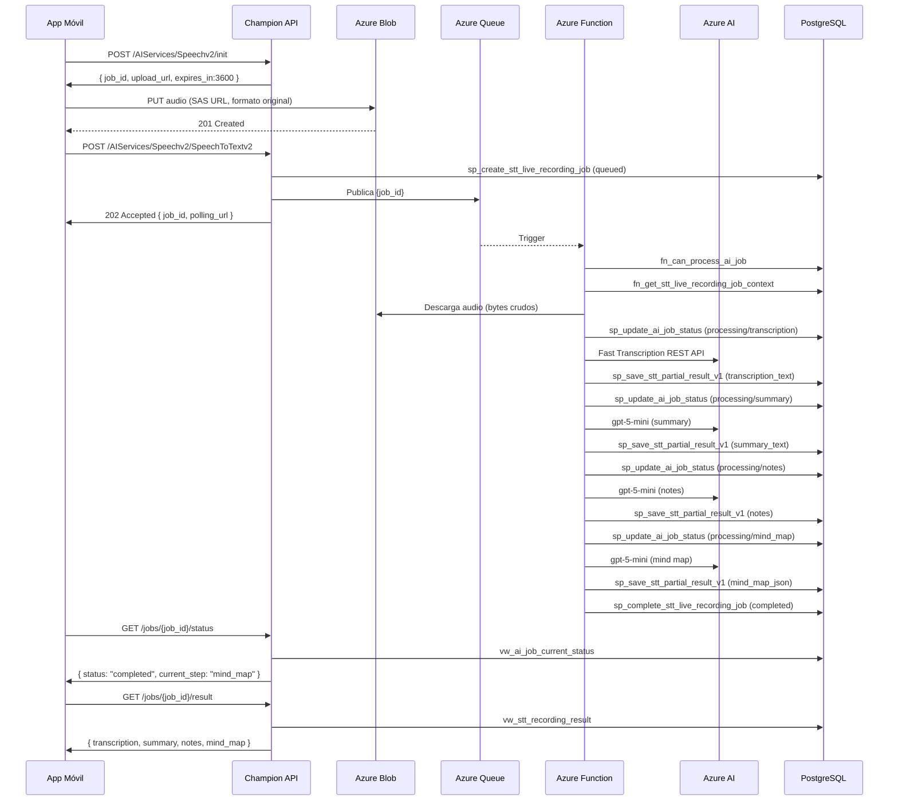

# Feature: Speech to Text (STT)

tags: #feature #stt #speech

---

## Descripción

La feature de Speech to Text permite al usuario grabar o seleccionar un audio y obtener como resultado:

- **Transcripción** del audio completo
- **Resumen** generado por IA a partir de la transcripción
- **Notas estructuradas** en formato texto y JSON
- **Mapa mental** en formato JSON

Esta es la **primera feature completamente implementada** del sistema.
Feature code: `live_recording`
Service code: `STT`
Flow: `flow_live_recording`

---

## Capacidades técnicas

| Atributo | Valores aceptados |
|---|---|
| Formatos de audio | `webm`, `mp4`, `m4a`, `mp3`, `wav`, `ogg`, `flac`, `aac` |
| Sample rates | `8000`, `16000`, `44100`, `48000` Hz |
| Duración máxima | `10800` segundos (3 horas) |
| Duración mínima | `1` segundo |
| Tamaño máximo | 200 MB por archivo |
| Idioma por defecto | `es-CL` (Spanish Chile) |

El audio se envía a Azure AI Speech en su **formato original** — no se realiza conversión a WAV ni a ningún otro formato.

---

## Pipeline de procesamiento

```
Audio (WebM / M4A / MP3 / OGG / WAV / FLAC / AAC)
        │
        ▼ transcription_activity.py
Azure AI Speech — Fast Transcription REST API
→ transcription_text
        │
        ▼ ai_activity.py
gpt-5-mini → summary_text
        │
        ▼ ai_activity.py
gpt-5-mini → notes_text + notes_json
        │
        ▼ ai_activity.py
gpt-5-mini → mind_map_json
        │
        ▼ completion_activity.py
sp_complete_stt_live_recording_job_v1
→ status: completed
```

**Próxima etapa planificada:** `transcript_cleanup` entre `transcription` y `summary` (EPIC V2 — Intelligent Study). Ver [[EPICS]].

---

## Qué produce

El procesamiento genera un único resultado consolidado (`stt_recording_result`):

```
1 job → 1 recording → 1 result
```

| Output | Tipo | Descripción |
|---|---|---|
| `transcription_text` | TEXT | Transcripción literal del audio |
| `summary_text` | TEXT | Resumen ejecutivo en Markdown |
| `notes_text` | TEXT | Notas estructuradas en Markdown |
| `notes_json` | JSONB | Notas en JSON `{title, overview, concepts[], examples[], important_details[], key_takeaways[]}` |
| `mind_map_json` | JSONB | Árbol JSON `{title, nodes[{name, children[]}]}` — profundidad máx. 4 |

---

## Flujo de extremo a extremo



---

## Estados del job en este flujo

```
queued
→ processing / transcription
→ processing / summary
→ processing / notes
→ processing / mind_map
→ completed
```

Cualquier paso puede transicionar a `failed`. Ver [[job-states]].

---

## Retry de jobs fallidos

Si un job llega a `failed`, el usuario puede solicitar un retry:

```
POST /AIServices/Speechv2/jobs/{job_id}/retry → 202
```

El retry usa **smart retry**: lee los resultados parciales ya guardados en `stt_recording_result` y solo re-ejecuta desde el paso que falló. Los pasos exitosos anteriores no se repiten.

Máximo 3 reintentos controlados por `sp_reset_ai_job_for_retry_v1`.

---

## Endpoints relacionados

| Endpoint | Propósito | Estado |
|---|---|---|
| `POST /AIServices/Speechv2/init` | Obtener SAS URL | Implementado |
| `POST /AIServices/Speechv2/SpeechToTextv2` | Crear job y encolar | Implementado |
| `GET /AIServices/Speechv2/jobs/{id}/status` | Polling de estado | Implementado |
| `GET /AIServices/Speechv2/jobs/{id}/result` | Obtener resultado | Implementado |
| `POST /AIServices/Speechv2/jobs/{id}/retry` | Reintentar job fallido | Implementado |

Ver [[backend-api]] para el contrato HTTP completo.

---

## Stored Procedures involucrados

| SP | Ejecutado por |
|---|---|
| `sp_create_stt_live_recording_job_v1` | Backend API |
| `sp_update_ai_job_status_v1` | Azure Function |
| `sp_save_stt_partial_result_v1` | Azure Function |
| `sp_complete_stt_live_recording_job_v1` | Azure Function |
| `sp_reset_ai_job_for_retry_v1` | Backend API |

Ver [[stored-procedures]].

---

## Tablas de base de datos

| Tabla | Rol en esta feature |
|---|---|
| `ai_job` | Job principal, estado, metadata |
| `ai_job_status_history` | Historial completo de cambios de estado |
| `stt_recording` | Metadata del audio subido |
| `stt_recording_result` | Resultado del procesamiento AI (incluyendo parciales) |

Ver [[tables]].

---

## Casos de error conocidos

| Error code | Cuándo ocurre |
|---|---|
| `QUEUE_SEND_FAILED` | Backend no puede publicar en la queue |
| `STT_ENGINE_UNAVAILABLE` | Azure AI Speech no disponible o error de red |
| `OPENAI_UNAVAILABLE` | gpt-5-mini no disponible o error de respuesta |
| `INVALID_BLOB_URL` | blob_url ausente o expirada |
| `DURATION_EXCEEDED` | Audio supera 3 horas |
| `UNSUPPORTED_FORMAT` | Formato de audio no soportado por la BD |
| `MAX_RETRIES_EXCEEDED` | El job ya alcanzó el límite de 3 reintentos |
| `JOB_NOT_RETRYABLE` | El job no está en estado `failed` |

Ver [[error-codes]].

---

## Referencias cruzadas

- [[upload-audio]] — Flujo de subida de audio
- [[stt-processing]] — Flujo de procesamiento en Azure Function
- [[polling]] — Cómo el cliente obtiene el resultado
- [[summaries]] — Feature de resúmenes
- [[notes]] — Feature de notas
- [[mind-maps]] — Feature de mapas mentales
- [[EPICS]] — Evolución futura del pipeline (EPIC V2 — Intelligent Study)
- [[job-states]] — Máquina de estados
