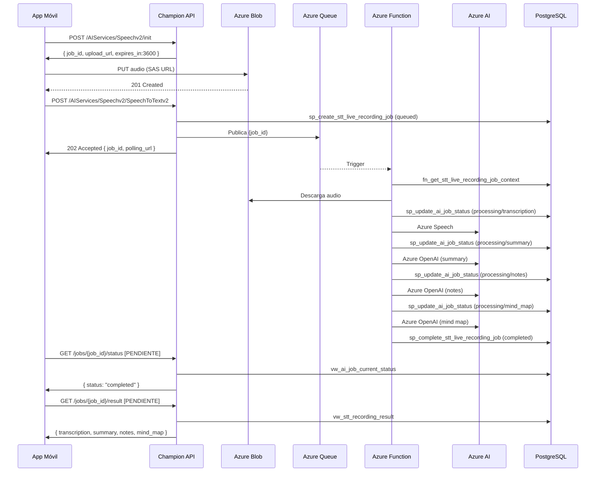

# Feature: Speech to Text (STT)

tags: #feature #stt #speech

---

## Descripción

La feature de Speech to Text permite al usuario grabar o seleccionar un audio y obtener como resultado:

- **Transcripción** del audio completo
- **Resumen** generado por IA a partir de la transcripción
- **Notas estructuradas** en formato texto y JSON
- **Mapa mental** en formato JSON

Esta es la **primera feature completamente implementada** del sistema.
Feature code: `live_recording`
Service code: `STT`
Flow: `flow_live_recording`

---

## Capacidades técnicas

| Atributo | Valores aceptados |
|---|---|
| Formatos de audio | `webm`, `mp4`, `m4a`, `mp3`, `wav`, `ogg` |
| Sample rates | `8000`, `16000`, `44100`, `48000` Hz |
| Duración máxima | `10800` segundos (3 horas) |
| Duración mínima | `1` segundo |
| Idioma por defecto | `es-CL` (Spanish Chile) |

---

## Qué produce

El procesamiento genera un único resultado consolidado (`stt_recording_result`):

```
1 job → 1 recording → 1 result
```

| Output | Tipo | Descripción |
|---|---|---|
| `transcription_text` | TEXT | Transcripción literal del audio |
| `summary_text` | TEXT | Resumen narrativo |
| `notes_text` | TEXT | Notas en formato texto |
| `notes_json` | JSONB | Notas estructuradas |
| `mind_map_json` | JSONB | Mapa mental estructurado |
| `raw_result_json` | JSONB | Respuesta cruda de los servicios AI |

Ver [[summaries]], [[notes]], [[mind-maps]].

---

## Flujo de extremo a extremo



---

## Estados del job en este flujo

```
queued
→ processing / transcription
→ processing / summary
→ processing / notes
→ processing / mind_map
→ completed
```

Cualquier paso puede transicionar a `failed`. Ver [[job-states]].

---

## Endpoints relacionados

| Endpoint | Propósito |
|---|---|
| `POST /AIServices/Speechv2/init` | Obtener SAS URL |
| `POST /AIServices/Speechv2/SpeechToTextv2` | Crear job y encolar |
| `GET /AIServices/Speechv2/jobs/{id}/status` | Polling de estado (PENDIENTE) |
| `GET /AIServices/Speechv2/jobs/{id}/result` | Obtener resultado (PENDIENTE) |

Ver [[backend-api]] para el contrato HTTP completo.

---

## Stored Procedures involucrados

| SP | Ejecutado por |
|---|---|
| `sp_create_stt_live_recording_job_v1` | Backend API |
| `sp_update_ai_job_status_v1` | Azure Function |
| `sp_complete_stt_live_recording_job_v1` | Azure Function |

Ver [[stored-procedures]].

---

## Tablas de base de datos

| Tabla | Rol en esta feature |
|---|---|
| `ai_job` | Job principal, estado, metadata |
| `ai_job_status_history` | Historial completo de cambios de estado |
| `stt_recording` | Metadata del audio subido |
| `stt_recording_result` | Resultado del procesamiento AI |

Ver [[tables]].

---

## Casos de error conocidos

| Error code | Cuándo ocurre |
|---|---|
| `QUEUE_SEND_FAILED` | Backend no puede publicar en la queue |
| `STT_ENGINE_UNAVAILABLE` | Azure Speech no disponible |
| `INVALID_BLOB_URL` | blob_url ausente o expirada |
| `DURATION_EXCEEDED` | Audio supera 3 horas |
| `UNSUPPORTED_FORMAT` | Formato de audio no soportado |

Ver [[error-codes]].

---

## Referencias cruzadas

- [[upload-audio]] — Flujo de subida de audio
- [[stt-processing]] — Flujo de procesamiento en Azure Function
- [[polling]] — Cómo el cliente obtiene el resultado
- [[summaries]] — Feature de resúmenes
- [[notes]] — Feature de notas
- [[mind-maps]] — Feature de mapas mentales
- [[job-states]] — Máquina de estados
