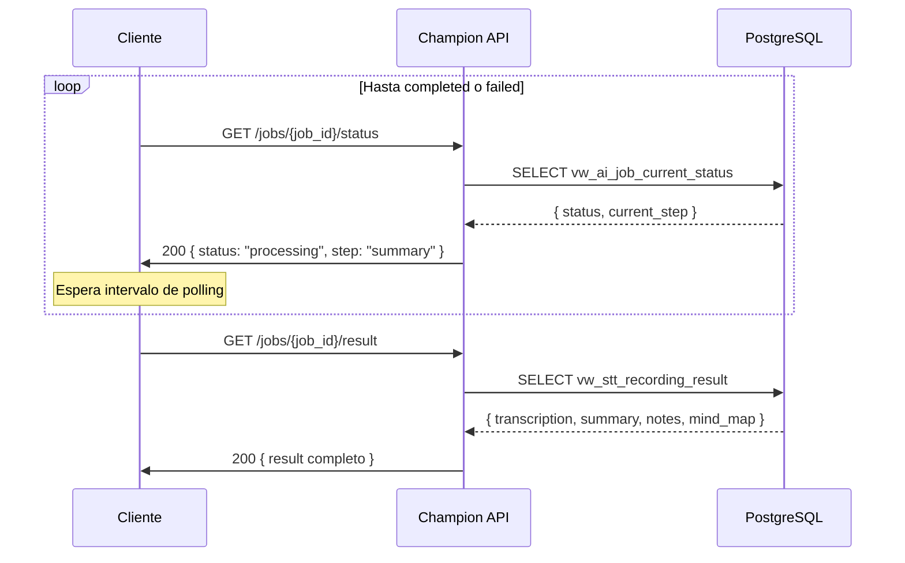

# Flujo: Polling de Estado y Resultado

tags: #flow #polling #status #result

---

## Estado de implementación

> **Ambos endpoints de polling están marcados como "Pendiente de implementación en el router"** en la documentación oficial.
> El contrato está definido, pero los endpoints no están activos.

---

## Descripción

Después de crear el job (ver [[upload-audio]]), el cliente no recibe el resultado de inmediato. El procesamiento es async. El cliente debe consultar periódicamente hasta que el job llegue a `completed` o `failed`.

---

## Endpoint 1: Consultar estado del job

```http
GET /AIServices/Speechv2/jobs/{job_id}/status
Authorization: Bearer {access_token}
```

El backend consulta la vista `vw_ai_job_current_status`.

### Respuestas posibles

**Processing — 200 OK:**
```json
{
  "success": true,
  "data": {
    "job_id": "job_550e8400-...",
    "status": "processing",
    "current_step": "summary"
  },
  "error": null
}
```

**Completed — 200 OK:**
```json
{
  "success": true,
  "data": {
    "job_id": "job_550e8400-...",
    "status": "completed"
  },
  "error": null
}
```

**Failed — 200 OK:**
```json
{
  "success": true,
  "data": {
    "job_id": "job_550e8400-...",
    "status": "failed",
    "error_code": "STT_ENGINE_UNAVAILABLE"
  },
  "error": null
}
```

**Errores del endpoint:**

| Status | Código | Motivo |
|---|---|---|
| 401 | `INVALID_TOKEN` | JWT ausente |
| 403 | `TOKEN_EXPIRED` | JWT inválido o expirado |
| 404 | `NOT_FOUND` | `job_id` no encontrado |
| 500 | `INTERNAL_ERROR` | Error interno |

---

## Endpoint 2: Obtener resultado final

Solo debe llamarse cuando `status = completed`.

```http
GET /AIServices/Speechv2/jobs/{job_id}/result
Authorization: Bearer {access_token}
```

El backend consulta la vista `vw_stt_recording_result`.

### Respuesta exitosa — 200 OK

```json
{
  "success": true,
  "data": {
    "job_id": "job_550e8400-...",
    "status": "completed",
    "result": {
      "transcription": "...",
      "summary": "...",
      "notes": "...",
      "mind_map": {}
    }
  },
  "error": null
}
```

**Errores del endpoint:**

| Status | Código | Motivo |
|---|---|---|
| 401 | `INVALID_TOKEN` | JWT ausente |
| 403 | `TOKEN_EXPIRED` | JWT inválido o expirado |
| 404 | `NOT_FOUND` | `job_id` no encontrado o sin resultado |
| 500 | `INTERNAL_ERROR` | Error interno |

---

## Estrategia de polling recomendada

El cliente debería:

```
1. Esperar N segundos antes del primer poll
2. Consultar GET /status
3. Si status = "processing" → esperar y volver a 2
4. Si status = "completed" → ir a 5
5. Si status = "failed"    → mostrar error al usuario
6. Consultar GET /result
```

> El intervalo de polling no está documentado. No existe webhook ni push notification en el sistema actual.

---

## Vistas que usa

| Endpoint | Vista |
|---|---|
| `/status` | `vw_ai_job_current_status` |
| `/result` | `vw_stt_recording_result` |

Ver [[views]] para el detalle de cada vista.

---

## Diagrama



---

## Referencias cruzadas

- [[upload-audio]] — Flujo previo (crea el job)
- [[stt-processing]] — Lo que ocurre mientras el cliente hace polling
- [[views]] — `vw_ai_job_current_status`, `vw_stt_recording_result`
- [[job-states]] — Estados posibles que devuelve el endpoint
- [[speech-to-text]] — Feature completa
- [[known-issues]] — Pendientes de implementación
