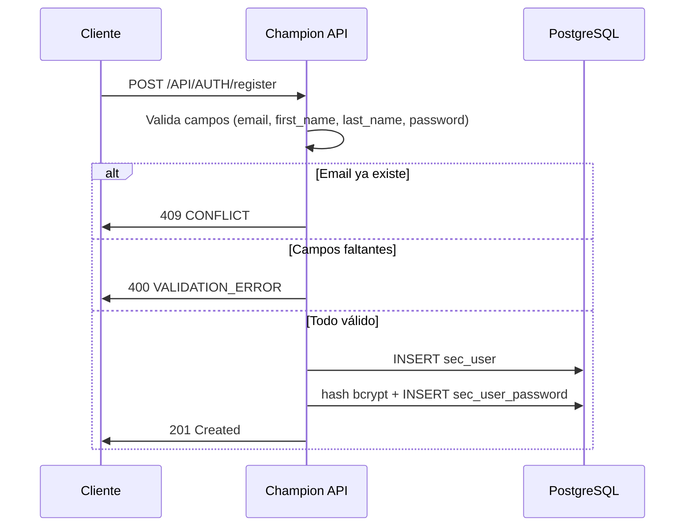

# Flujo: Registro de Usuario

tags: #flow #auth #register

---

## Descripción

El registro es el punto de entrada al sistema. Crea una cuenta de usuario con email y contraseña.
No requiere autenticación previa.

---

## Endpoint

```http
POST /API/AUTH/register
Content-Type: application/json
```

---

## Payload

```json
{
  "email": "usuario@championai.app",
  "first_name": "Nombre",
  "last_name": "Apellido",
  "password": "Password123!"
}
```

---

## Operaciones en base de datos

La API ejecuta dos operaciones al registrar:

1. **Inserta en `sec_user`**
   - Genera `user_id` (UUID via `gen_random_uuid()`)
   - Almacena `email`, `first_name`, `last_name`
   - `is_active = true` por defecto

2. **Inserta en `sec_user_password`**
   - Genera hash bcrypt de la contraseña
   - `password_algorithm = 'bcrypt'`
   - `is_active = true`

> No existe un Stored Procedure documentado para el registro. La lógica parece estar en el backend directamente (a diferencia del STT que usa SPs).

---

## Respuestas

### Éxito — 201 Created

```json
{
  "success": true,
  "data": {
    "message": "Usuario creado satisfactoriamente."
  },
  "error": null
}
```

### Error — 400 Bad Request

```json
{
  "success": false,
  "data": null,
  "error": {
    "code": "VALIDATION_ERROR",
    "message": "Campos faltantes en el body"
  }
}
```

### Error — 409 Conflict

```json
{
  "success": false,
  "data": null,
  "error": {
    "code": "CONFLICT",
    "message": "El correo electrónico ya está registrado."
  }
}
```

---

## Diagrama



---

## Restricciones del sistema

- El email es único (índice `uq_sec_user_email_lower` — case insensitive)
- Solo puede haber una contraseña activa por usuario (`uq_sec_user_password_active`)
- Si el email ya existe → `409 CONFLICT`

---

## Qué viene después

Tras el registro exitoso, el usuario debe hacer [[login]] para obtener el JWT y acceder a los servicios.

---

## Referencias cruzadas

- [[login]] — Siguiente paso tras el registro
- [[tables]] — Tablas `sec_user` y `sec_user_password`
- [[backend-api]] — Contrato HTTP completo
- [[error-codes]] — Catálogo de errores
