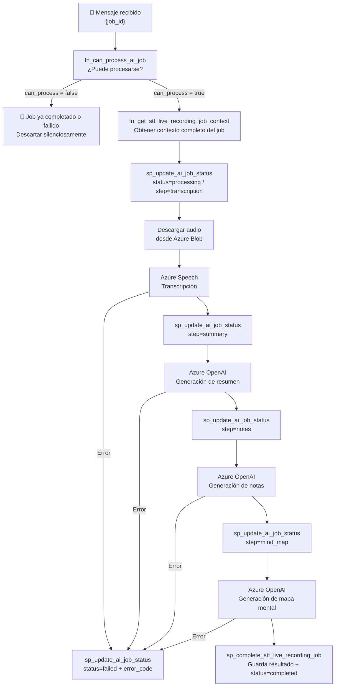

# Flujo: Procesamiento STT en Azure Function

tags: #flow #processing #azure-function #async

---

## Descripción

Después de que la API publica el `job_id` en la queue, el procesamiento ocurre de forma **completamente asíncrona** dentro de la Azure Function. El cliente no está conectado durante este proceso: consulta el resultado via polling.

---

## Trigger

La Function se activa automáticamente cuando llega un mensaje a:
```
Queue: champion-ai-stt-live-recording
Mensaje: { "job_id": "job_550e8400-..." }
```

---

## Cadena de procesamiento



---

## Paso a paso detallado

### 0. Guard: verificar si el job puede procesarse

```sql
fn_can_process_ai_job(job_id)
-- Devuelve: can_process (bool), reason (TEXT), current_status
```

Si `can_process = false`:
- Razones: `JOB_NOT_FOUND`, `JOB_ALREADY_COMPLETED`, `JOB_ALREADY_FAILED`, `INVALID_JOB_STATUS`
- La Function detiene el procesamiento sin error (manejo de redelivery)

### 1. Obtener contexto completo

```sql
fn_get_stt_live_recording_job_context(job_id)
```

Devuelve todo lo necesario para procesar:
- `user_id`, `service_code`, `feature_code`, `flow`
- `recording_id`, `language_locale`, `audio_format`, `blob_url`
- `status`, `current_step`

### 2. Transcripción

```
sp_update_ai_job_status → status=processing, step=transcription
↓
Descarga audio desde blob_url
↓
Azure Speech Service → transcription_text
```

### 3. Resumen

```
sp_update_ai_job_status → step=summary
↓
Azure OpenAI(transcription_text) → summary_text
```

### 4. Notas

```
sp_update_ai_job_status → step=notes
↓
Azure OpenAI(transcription_text) → notes_text + notes_json
```

### 5. Mapa mental

```
sp_update_ai_job_status → step=mind_map
↓
Azure OpenAI(transcription_text) → mind_map_json
```

### 6. Completar

```
sp_complete_stt_live_recording_job_v1(
  job_id, final_status='completed',
  transcription_text, summary_text,
  notes_text, notes_json, mind_map_json
)
```

Este SP:
1. Busca el `recording_id` para el job
2. Inserta (o actualiza) `stt_recording_result` con todos los outputs
3. Marca el historial anterior como `is_current=false`
4. Inserta nuevo historial con `status=completed`
5. Actualiza `ai_job.completed_at`

---

## Manejo de errores

En cualquier paso que falle:

```sql
sp_update_ai_job_status_v1(
  p_job_id     => '{job_id}',
  p_status     => 'failed',
  p_step_name  => '{paso}',
  p_error_code => 'STT_ENGINE_UNAVAILABLE'  -- u otro código
)
```

El job queda en `failed` con información del paso que falló y el código de error.

---

## Regla crítica

> La Azure Function NUNCA ejecuta DML directo.
> Solo puede llamar Stored Procedures o Functions.

Ver [[ADR-002-stored-procedures-only]].

---

## Idempotencia

Si el mismo mensaje llega dos veces (at-least-once delivery):
- El guard `fn_can_process_ai_job` rechazará el segundo intento
- Si llegara a `sp_complete_stt_live_recording_job_v1`, el `ON CONFLICT DO UPDATE` protege contra duplicados

Ver [[ADR-006-idempotent-stored-procedures]].

---

## Acceso directo a base de datos

La Function se conecta **directamente a PostgreSQL** (no via API):

```
Azure Function → PostgreSQL:5432 (directo)
```

Esta conexión directa es intencional para evitar que el backend sea intermediario del procesamiento.

---

## Estados producidos

```
queued
→ processing / transcription
→ processing / summary
→ processing / notes
→ processing / mind_map
→ completed
        ↓ (cualquier paso puede derivar en)
      failed
```

Ver [[job-states]] para la máquina de estados completa.

---

## Referencias cruzadas

- [[upload-audio]] — Flujo previo (crea el job y lo encola)
- [[polling]] — Flujo posterior (el cliente consulta el resultado)
- [[azure-function]] — Descripción del componente
- [[azure-services]] — Azure Queue, Blob y AI
- [[stored-procedures]] — SPs usados en este flujo
- [[functions]] — `fn_can_process_ai_job`, `fn_get_stt_live_recording_job_context`
- [[job-states]] — Máquina de estados
- [[ADR-002-stored-procedures-only]] — Regla de acceso a BD
