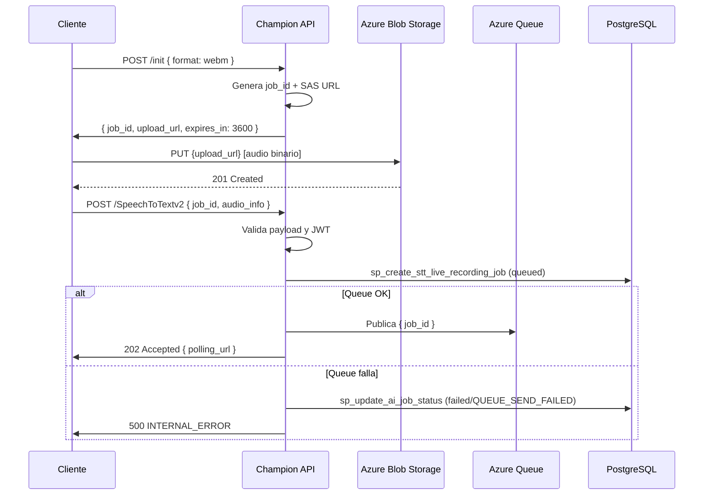

# Flujo: Upload de Audio

tags: #flow #upload #blob #sas

---

## Descripción

El upload de audio se divide en tres pasos:
1. **Init** — la API genera una SAS URL para subida directa
2. **Upload** — el cliente sube el audio directamente a Azure Blob (sin pasar por la API)
3. **Create job** — el cliente notifica a la API para iniciar el procesamiento

Este diseño es intencional: el binario de audio nunca pasa por el backend.
Ver [[ADR-003-sas-direct-upload]].

---

## Paso 1: Inicializar el upload

```http
POST /AIServices/Speechv2/init
Authorization: Bearer {access_token}
Content-Type: application/json
```

**Body:**
```json
{
  "req_info": {
    "audio": {
      "format": "webm"
    }
  }
}
```

**Lo que hace el backend:**
1. Valida JWT → extrae `user_id`
2. Genera `job_id` → `"job_{uuid}"`
3. Genera `blob_name` → `"{job_id}.webm"`
4. Genera **SAS URL** temporal (expira en 3600s)
5. Construye `blob_url` permanente

**Respuesta exitosa — 201 Created:**
```json
{
  "success": true,
  "data": {
    "job_id": "job_550e8400-e29b-41d4-a716-446655440000",
    "blob_name": "job_550e8400-e29b-41d4-a716-446655440000.webm",
    "upload_url": "https://storage.blob.core.windows.net/audio/...?sv=...&sig=...",
    "expires_in": 3600
  },
  "error": null
}
```

---

## Paso 2: Subir el audio a Azure Blob

El cliente hace un `PUT` directamente a la `upload_url`. El backend **no interviene**.

```bash
curl -X PUT "{upload_url}" \
  -H "x-ms-blob-type: BlockBlob" \
  -H "Content-Type: audio/webm" \
  --data-binary "@audio.webm"
```

**Path final en Blob Storage:**
```
audio/{user_uuid}/{job_id}/{job_id}.webm
```

**Respuesta esperada de Azure Blob:** `201 Created`

---

## Paso 3: Iniciar procesamiento

```http
POST /AIServices/Speechv2/SpeechToTextv2
Authorization: Bearer {access_token}
Content-Type: application/json
```

**Body:**
```json
{
  "req_info": {
    "job_id": "job_550e8400-e29b-41d4-a716-446655440000",
    "service": "STT",
    "feature": "live_recording",
    "flow": "flow_live_recording",
    "language_info": {
      "locale": "es-CL",
      "locale_name": "Spanish (Chile)"
    }
  },
  "audio_info": {
    "format": "webm",
    "sample_rate": 16000,
    "duration_seconds": 120,
    "blob_url": "https://storage.blob.core.windows.net/audio/..."
  }
}
```

**Validaciones del backend:**

| Validación | Regla |
|---|---|
| JWT | Válido y no expirado |
| `user_id` | El del token debe coincidir con el job |
| `audio.format` | `webm | mp4 | m4a | mp3 | wav | ogg` |
| `sample_rate` | `8000 | 16000 | 44100 | 48000` |
| `duration_seconds` | Entre 1 y 10800 segundos |
| `blob_url` | Presente y no expirada |

**Lo que hace el backend:**
1. Valida JWT y payload
2. Ejecuta `sp_create_stt_live_recording_job_v1` → job en estado `queued`
3. Publica `{ "job_id": "..." }` en queue `champion-ai-stt-live-recording`
4. Si falla el envío a queue: marca el job como `failed` con `QUEUE_SEND_FAILED`

**Respuesta exitosa — 202 Accepted:**
```json
{
  "success": true,
  "data": {
    "job_id": "job_550e8400-e29b-41d4-a716-446655440000",
    "status": "accepted",
    "flow": "flow_live_recording",
    "polling_url": "/AIServices/Speechv2/jobs/job_550e8400-.../status",
    "created_at": "2026-06-12T10:00:00.000Z"
  },
  "error": null
}
```

---

## Diagrama completo



---

## Errores posibles en el Paso 3

| Status | Código | Motivo |
|---|---|---|
| 400 | `INVALID_PAYLOAD` | `req_info` ausente |
| 400 | `INVALID_STT_CONTEXT` | `req_info` o `audio_info` mal formados |
| 400 | `UNSUPPORTED_FORMAT` | Formato no soportado |
| 400 | `INVALID_SAMPLE_RATE` | Sample rate inválido |
| 400 | `DURATION_EXCEEDED` | Audio > 3 horas |
| 400 | `INVALID_BLOB_URL` | `blob_url` ausente o expirada |
| 401 | `INVALID_TOKEN` | JWT ausente |
| 403 | `TOKEN_EXPIRED` | JWT inválido o expirado |
| 403 | `USER_MISMATCH` | `user_id` del token no coincide con el payload |
| 500 | `JOB_CREATION_FAILED` | No se pudo crear el job en BD |
| 500 | `INTERNAL_ERROR` | Error no clasificado |

---

## Qué viene después

Una vez creado el job, el cliente pasa al flujo de [[polling]] para consultar el estado hasta obtener el resultado.

El procesamiento ocurre en [[stt-processing]].

---

## Referencias cruzadas

- [[login]] — Paso previo (necesita JWT)
- [[stt-processing]] — Lo que ocurre después del 202
- [[polling]] — Cómo obtener el resultado
- [[azure-services]] — Azure Blob y Queue
- [[ADR-003-sas-direct-upload]] — Por qué upload directo
- [[stored-procedures]] — `sp_create_stt_live_recording_job_v1`
- [[error-codes]] — Catálogo completo
