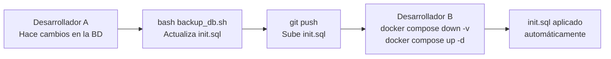

# Gestión de Base de Datos

tags: #operations #database #backup #docker

---

## Principio de gestión

El schema de la BD está **versionado en el repositorio** mediante `App/docker/postgres/init.sql`.
Todo el equipo trabaja con la misma versión del schema.

---

## Hacer backup y compartir cambios

El script `App/backup_db.sh` sincroniza el estado actual de la BD con el repositorio.

### Prerequisito

El contenedor `postgres_db` debe estar corriendo:
```bash
docker compose up -d
```

### Ejecutar backup

```bash
cd App
bash backup_db.sh
```

### Qué hace el script

1. Verifica que el contenedor esté activo
2. Genera un dump completo de la BD con timestamp
   - Destino: `App/backups/champion_db_{YYYYMMDD}_{HHMMSS}.sql`
3. Copia el dump a `App/docker/postgres/init.sql` (actualiza el schema versionado)
4. Elimina backups antiguos, manteniendo solo los últimos 10

> Los archivos en `App/backups/` están en `.gitignore` y no se suben al repositorio.

### Compartir los cambios con el equipo

```bash
git add App/docker/postgres/init.sql
git commit -m "chore: update db schema"
git push
```

---

## Aplicar schema actualizado (como compañero de equipo)

Cuando otro miembro del equipo actualiza el `init.sql`:

```bash
# Desde App/
docker compose down -v && docker compose up -d
```

Esto:
1. Borra el volumen actual (todos los datos locales)
2. Levanta un nuevo contenedor
3. Aplica el `init.sql` actualizado automáticamente

> **Importante:** Esto borra todos los datos locales. Guardar cualquier dato de prueba antes de ejecutar.

---

## Flujo de trabajo para cambios de schema



---

## Migraciones

Las migraciones SQL están en `App/SQL/Migrations/`.

Migraciones registradas:

| Archivo | Cambio |
|---|---|
| `add_profile_fields_to_sec_user.sql` | Agrega `phone`, `location`, `occupation`, `avatar_url` a `sec_user` |
| `migrate_duration_seconds_to_numeric.sql` | Cambia `duration_seconds` de INTEGER a NUMERIC(10,3) en varios objetos |

**Importante:** El `init.sql` ya incorpora estas migraciones. Las migraciones individuales son para referencia histórica o para aplicar manualmente en ambientes ya existentes.

---

## Conexión directa a la BD

Para consultar la BD en desarrollo:

```bash
# Acceder al contenedor
docker exec -it postgres_db psql -U champion_db_user -d champion_db

# Comandos útiles dentro de psql
\dt          -- listar tablas
\dv          -- listar vistas
\df          -- listar funciones
\dp          -- listar stored procedures
\q           -- salir
```

---

## Variables de conexión

| Variable | Valor por defecto |
|---|---|
| Host | `localhost` |
| Puerto | `5432` |
| Usuario | `champion_db_user` |
| Base de datos | `champion_db` |
| Contraseña | definida en `.env` |

---

## Referencias cruzadas

- [[local-setup]] — Setup completo incluyendo Docker
- [[schema-overview]] — Qué contiene la BD
- [[tables]] — Tablas del sistema
