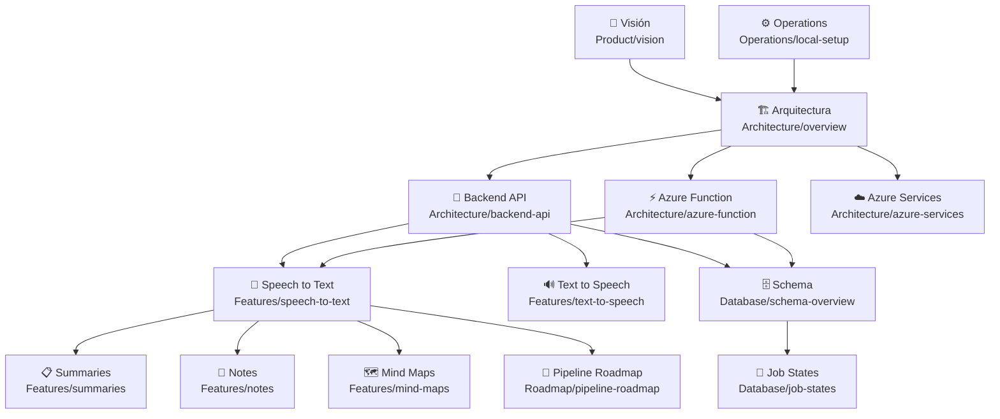

# Champion AI — Bóveda de Conocimiento

> Fuente de conocimiento derivada del proyecto. No modifica el código original.
> Última actualización: 2026-07-01

---

## Qué es este vault

Esta bóveda representa el conocimiento del proyecto Champion AI en formato Obsidian.
Está diseñada para ser consumida por Claude Code, MCP Obsidian, y cualquier asistente de IA que trabaje sobre el proyecto.

**No es documentación duplicada**: es conocimiento inferido, sintetizado y enlazado.

---

## Mapa del conocimiento



---

## Índice por carpeta

### Product — Visión del producto
- [[vision]] — Visión, usuarios, objetivos, equipo

### Architecture — Sistema y componentes
- [[overview]] — Diagrama general del sistema
- [[backend-api]] — API Node.js / Express
- [[azure-function]] — Azure Function (Queue Trigger, Python / Durable Functions)
- [[azure-services]] — Azure Blob, Queue, Fast Transcription, OpenAI

### Features — Funcionalidades
- [[speech-to-text]] — STT live_recording (implementada)
- [[text-to-speech]] — TTS (pendiente de documentación)
- [[summaries]] — Generación de resúmenes
- [[notes]] — Notas estructuradas
- [[mind-maps]] — Mapas mentales

### Flows — Flujos del sistema
- [[registration]] — Registro de usuario
- [[login]] — Autenticación JWT
- [[upload-audio]] — Init upload + SAS + subida directa
- [[stt-processing]] — Procesamiento async en Azure Function
- [[polling]] — Consulta de estado y resultado

### Database — Base de datos
- [[schema-overview]] — Diagrama relacional y principios
- [[tables]] — Definición de cada tabla
- [[views]] — Vistas del sistema
- [[stored-procedures]] — Stored Procedures y su lógica
- [[functions]] — Funciones y triggers
- [[job-states]] — Máquina de estados de un Job

### ADR — Decisiones arquitectónicas
- [[ADR-001-queue-based-processing]] — Por qué usar Azure Queue + Function
- [[ADR-002-stored-procedures-only]] — Por qué la Function solo llama SPs
- [[ADR-003-sas-direct-upload]] — Por qué el upload va directo a Azure Blob
- [[ADR-004-response-envelope]] — Contrato `{ success, data, error }`
- [[ADR-005-is-current-pattern]] — Flag `is_current` en historial de estados
- [[ADR-006-idempotent-stored-procedures]] — Idempotencia ante redelivery de queue
- [[ADR-007-fast-transcription]] — Por qué Fast Transcription en lugar de SDK Continuous Recognition

### Bugs — Problemas conocidos
- [[known-issues]] — Vacíos, contradicciones y pendientes

### Operations — Operaciones
- [[local-setup]] — Setup local completo
- [[database-management]] — Backup y sincronización de BD
- [[error-codes]] — Catálogo de errores HTTP

### Roadmap — Futuro
- [[pending-features]] — Features no implementadas
- [[pipeline-roadmap]] — Evolución del pipeline de procesamiento inteligente

---

## Estado del proyecto

| Componente | Estado |
|---|---|
| Auth (register + login) | Implementado |
| STT live_recording — pipeline completo | Implementado |
| STT polling `/jobs/{id}/status` | Implementado |
| STT resultado `/jobs/{id}/result` | Implementado |
| STT retry de jobs fallidos | Implementado |
| STT Transcript Cleanup | Planificado |
| STT Topic Extraction | Roadmap |
| Text to Speech | Sin documentar |
| File Management | Sin documentar |

---

## Fuentes de este vault

```
Champion-AI/README.md
Champion-AI/ARCHITECTURE.md
Champion-AI/CLAUDE.md
Champion-AI/App/API/CLAUDE.md
Champion-AI/App/procesamiento/CLAUDE.md
Champion-AI/App/SQL/Stored Procedures/
Champion-AI/App/SQL/Functions/
Champion-AI/App/docker/postgres/init.sql
Champion-AI/App/procesamiento/prompts/
```
