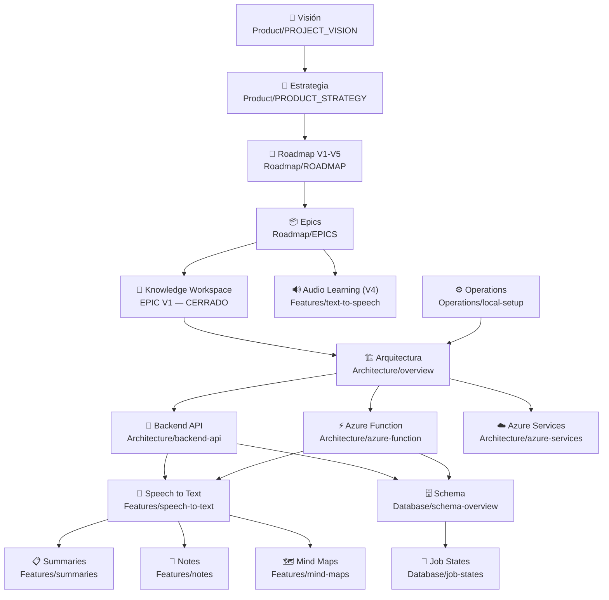

# Champion AI — Bóveda de Conocimiento

> Fuente de conocimiento derivada del proyecto. No modifica el código original.
> Última actualización: 2026-08-12 — auditoría completa (skill `sync-knowledge-vault`): Knowledge
> Workspace V1 marcado como cerrado/en producción, índice de ADRs completado (009–014), endpoint
> surface de la API re-verificado contra el código, carpetas `Reference/` (espejos de
> `CLAUDE.md`/`ARCHITECTURE.md`), `Changelog/` y `Prompts/` incorporadas al índice. Antes de esa
> fecha: 2026-07-13 — reorganización completa del roadmap hacia el Knowledge Workspace.

---

## Qué es este vault

Esta bóveda representa el conocimiento del proyecto Champion AI en formato Obsidian.
Está diseñada para ser consumida por Claude Code, MCP Obsidian, y cualquier asistente de IA que trabaje sobre el proyecto.

**No es documentación duplicada**: es conocimiento inferido, sintetizado y enlazado.

---

## Mapa del conocimiento



---

## Índice por carpeta

### Product — Visión y estrategia del producto
- [[PROJECT_VISION]] — Visión, cadena de valor (Champion AI → Knowledge Packs → Knowledge Workspace → Herramientas Inteligentes de Aprendizaje), usuarios, equipo
- [[PRODUCT_STRATEGY]] — Por qué el Knowledge Workspace reemplaza la vista Markdown, criterios de priorización V1-V5, métricas de éxito

### Architecture — Sistema y componentes
- [[overview]] — Diagrama general del sistema
- [[backend-api]] — API Node.js / Express
- [[azure-function]] — Azure Function (Queue Trigger, Python / Durable Functions)
- [[azure-services]] — Azure Blob, Queue, Fast Transcription, OpenAI

### Features — Funcionalidades
- [[speech-to-text]] — STT live_recording (implementada) — base sobre la que se construye el Knowledge Workspace
- [[text-to-speech]] — Narración inteligente de audio (roadmapeada, EPIC V4)
- [[summaries]] — Generación de resúmenes
- [[notes]] — Notas estructuradas
- [[mind-maps]] — Mapas mentales (se integran al Workspace en V1, interactivos en V3)

### Flows — Flujos del sistema
- [[registration]] — Registro de usuario
- [[login]] — Autenticación JWT
- [[upload-audio]] — Init upload + SAS + subida directa
- [[stt-processing]] — Procesamiento async en Azure Function
- [[polling]] — Consulta de estado y resultado

### Database — Base de datos
- [[schema-overview]] — Diagrama relacional y principios
- [[tables]] — Definición de cada tabla
- [[views]] — Vistas del sistema
- [[stored-procedures]] — Stored Procedures y su lógica
- [[functions]] — Funciones y triggers
- [[job-states]] — Máquina de estados de un Job

### ADR — Decisiones arquitectónicas
- [[ADR-001-queue-based-processing]] — Por qué usar Azure Queue + Function
- [[ADR-002-stored-procedures-only]] — Por qué la Function solo llama SPs
- [[ADR-003-sas-direct-upload]] — Por qué el upload va directo a Azure Blob
- [[ADR-004-response-envelope]] — Contrato `{ success, data, error }`
- [[ADR-005-is-current-pattern]] — Flag `is_current` en historial de estados
- [[ADR-006-idempotent-stored-procedures]] — Idempotencia ante redelivery de queue
- [[ADR-007-fast-transcription]] — Por qué Fast Transcription en lugar de SDK Continuous Recognition
- [[ADR-008-knowledge-workspace]] — Por qué el Knowledge Workspace reemplaza la vista Markdown
- [[ADR-009-mobile-navigation-manager-viewer-seam]] — Seam de navegación manager ("Mis Apuntes") ↔ viewer
- [[ADR-010-knowledge-pack-lifecycle-actions]] — Editar (renombrar/reprocesar), Eliminar (soft delete)
- [[ADR-011-local-job-completion-notifications]] — Notificaciones locales del SO al completar un job
- [[ADR-012-background-upload-manager]] — Subida de audio sobreviviendo a la navegación
- [[ADR-013-math-rendering-pipeline-rewrite]] — Reescritura de raíz del pipeline Markdown+LaTeX
- [[ADR-014-knowledge-workspace-versioning]] — Flip a producción + convención Beta permanente

### Bugs — Problemas conocidos
- [[known-issues]] — Vacíos, contradicciones y pendientes (incluye retiro de Gestión de Archivos y riesgo de regresión de Mermaid)

### Operations — Operaciones
- [[local-setup]] — Setup local completo
- [[database-management]] — Backup y sincronización de BD
- [[error-codes]] — Catálogo de errores HTTP

### Roadmap — Roadmap oficial (reemplaza por completo al roadmap anterior)
- [[ROADMAP]] — Versiones V1–V5, referencia maestra
- [[EPICS]] — Cada versión desglosada en EPIC (objetivo, historias, subtareas, dependencias, criterios de aceptación, riesgos, prioridad, estimación)
- [[BACKLOG]] — Issues listos para GitHub, labels, jerarquía epic/issue/sub-issue
- [[MILESTONES]] — Mapeo de versiones a GitHub Milestones — **M1 cerrado**, M2 (Intelligent Study) es el próximo
- [[SPRINT_PLANNING]] — Marco Scrum, Sprint 1 cerrado

### Changelog — Historial de sesiones de trabajo
- `App/Knowledge/Changelog/changelog_YYYYMMDD.md` — un archivo por sesión de trabajo significativa, con el detalle técnico completo de qué cambió y por qué. Ver el más reciente para el estado más granular.

### Prompts — Espejo de los prompts de Azure OpenAI
- `App/Knowledge/Prompts/{system,summary,notes,notes_json,mind_map}.md` — copias sincronizadas de `App/procesamiento/prompts/*.md` (fuente real que consume gpt-5-mini). Mantenidos al día por la skill `sync-knowledge-vault`.

### Reference — Espejos verbatim de CLAUDE.md / ARCHITECTURE.md
- `App/Knowledge/Reference/CLAUDE.md`, `ARCHITECTURE.md`, `API-CLAUDE.md`, `Mobile-CLAUDE.md`, `procesamiento-CLAUDE.md` — copias exactas de los archivos de contexto para Claude Code que viven fuera de la bóveda (raíz del repo y por componente). Existen para que un consumidor que solo indexa `App/Knowledge/` (p. ej. un LLM local) tenga acceso al mismo nivel de detalle que Claude Code. Mantenidos por la skill `sync-knowledge-vault` — no editar a mano, editar la fuente y re-ejecutar la skill.

---

## Estado del proyecto

| Componente | Estado |
|---|---|
| Auth (register + login) | Implementado |
| STT live_recording — pipeline completo | Implementado |
| STT polling `/jobs/{id}/status` | Implementado |
| STT resultado `/jobs/{id}/result` | Implementado |
| STT retry de jobs fallidos | Implementado |
| Gestión de Knowledge Packs (renombrar, soft delete, reprocesar step) | Implementado |
| Knowledge Workspace (V1) | **Implementado — en producción desde 2026-08-10** |
| Intelligent Study — Transcript Cleanup, Topics (V2) | Roadmap — próximo a iniciar |
| Knowledge Enrichment (V2.5) | Roadmap |
| AI Learning Platform — Flashcards, Quiz, Chat (V3) | Roadmap |
| Intelligent Audio Learning — narración (V4) | Roadmap |
| Knowledge Platform — grafo, búsqueda semántica (V5) | Roadmap |

> Gestión de Archivos genérica fue retirada del roadmap activo — ver [[known-issues]].

---

## Fuentes de este vault

```
Champion-AI/README.md
Champion-AI/ARCHITECTURE.md
Champion-AI/CLAUDE.md
Champion-AI/COWORK.md
Champion-AI/App/API/CLAUDE.md
Champion-AI/App/procesamiento/CLAUDE.md
Champion-AI/App/SQL/Stored Procedures/
Champion-AI/App/SQL/Functions/
Champion-AI/App/docker/postgres/init.sql
Champion-AI/App/procesamiento/prompts/
```
